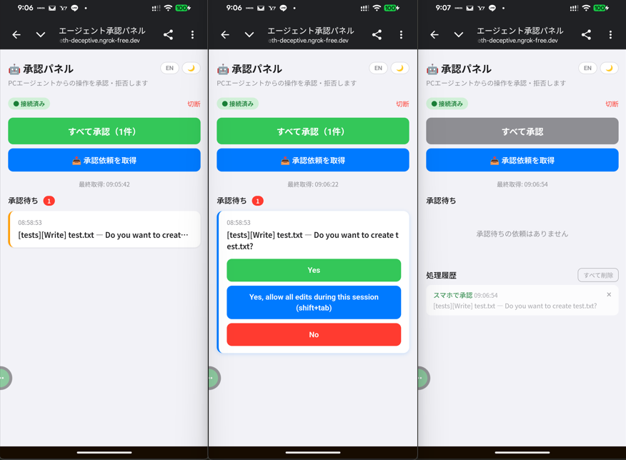
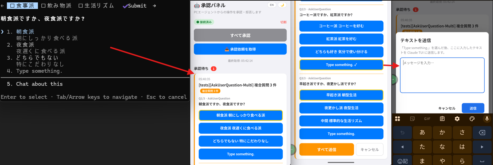

# claude-approval-server

Claude Code の承認ダイアログを、PC ターミナルと**スマートフォン（または PC ブラウザ）の両方**から承認・拒否できるようにするツールです。

PTY ラッパーが Claude Code の入出力を仲介し、ダイアログが出ると

- PC ターミナルに従来どおり表示（1/2/3 キーで応答可能）
- **同時に** スマートフォン／PC ブラウザの承認パネルにも表示

どちらで応答しても、もう一方の表示は自動的に閉じます。



## 特徴

- **Claude Code の設定を変更しない**: `~/.claude/settings.json` の hooks には何も書きません。ラッパー経由で `claude` を起動するだけで動作し、ラッパーの利用を止めればそのまま元の挙動に戻ります
- **CLI 作業中に離席しても作業を継続できる**: 承認だけスマホ・別 PC から人手で応答できるため、`PreToolUse` フックに自動承認ロジックを書く必要がありません
- **既存の hooks と非干渉**: PTY の入出力を観察するだけで Claude Code 内部には介入しないため、`PreToolUse` 等の自前 hooks がある環境にもそのまま追加できます
- **複数プロジェクトを 1 画面に集約**: `[projectName][toolName]` 形式で識別され、並行プロジェクトの依頼が同じスマホ画面に届きます
- **Yes/No 系の承認だけでなく対話的選択にも対応**(v1.10+):
  - **AskUserQuestion**: Claude Code が選択肢を提示するダイアログ(v1.10+)
  - **複合質問(Multi)**: 複数質問を 1 ダイアログにまとめたタブ式 AskUserQuestion(v1.11+)
  - **Type something のテキスト送信**(v1.12+): スマホからフリーテキストを Claude TUI に注入できる。単一質問・複合質問の両方で対応
  - **ダイアログのキャンセル**(v1.12+): スマホから Esc 相当の操作でダイアログを破棄して通常チャットに戻る
  - **プラン承認(ExitPlanMode)対応**(v1.14+): 「Would you like to proceed?」のプラン承認プロンプトもスマホに転送。終端マーカーが `Esc to cancel` ではなく `shift+tab to approve` のため検出条件を拡張



PC ターミナル(左)に表示された複合質問が、そのままスマホの承認パネルに転送されます。各タブで通常の選択肢(数字)を選ぶか、Type something を押せばテキスト入力モーダル(右端)が開き、フリーテキストでも回答できます。全タブの回答が揃ったら「すべて送信」で PC TUI へ一括反映、操作を取りやめたいときは隣の「キャンセル」で Esc 相当の破棄ができます。

### hooks 方式との違い

| 観点 | hooks (`PreToolUse` 等) | 本ツール |
|---|---|---|
| 設定変更 | `settings.json` に hook を登録する必要あり | 不要（Claude Code 側に書き込みなし） |
| 離席中の承認 | hook で自動応答ロジックを書く | スマホで人手応答 |
| 既存 hooks との共存 | 競合に注意 | 干渉しない |
| Claude Code 更新追従 | hook 契約変更で壊れることがある | PTY 表示形式の追従だけで済む |

## 公式機能（/dispatch・/remote-control）との違い

Claude Code を遠隔から扱う公式機能として **/dispatch**（Cowork 経由）と **/remote-control**（Claude Code v2.1.51+）が提供されていますが、本ツールは **承認ダイアログのみ** を遠隔化する点で立ち位置が異なります。

| ツール | 遠隔化する対象 | リモート側でできること | 通信経路 | 必要なプラン |
|---|---|---|---|---|
| **本ツール** | 承認ダイアログだけ | Yes / No（1 / 2 / 3 相当） | 自分の PC ⇄ ngrok ⇄ 自分のスマホ | 不要（OSS・自前ホスト） |
| **/dispatch**（Cowork） | 新規タスクの投入口 | 「これやって」と投げる、cron 的なスケジュール投入 | Anthropic クラウド経由 | Claude アカウント |
| **/remote-control** | PC 上で動作中のセッション全体 | プロンプト送信・出力閲覧などほぼフル操作 | Anthropic クラウド経由 | Pro / Max / Team / Enterprise（API キー不可） |

### プロジェクトをまたいで使えるか

複数プロジェクトを並行して走らせる運用では、各機能の挙動が大きく異なります。

- **本ツール**: サーバーと ngrok は 1 組だけ起動し、各プロジェクトで `claude-wrapper.js` を立ち上げれば **すべての依頼が同じ承認パネルに集約** されます（`[projectName][toolName]` 形式で識別）。スマホ 1 画面で複数プロジェクトの承認を一括で捌ける点が最大の強みです。
- **/dispatch**: スマホから投げたタスクごとに Anthropic 側が適切なセッションを spawn します。**プロジェクトごとに別セッション** が立つため、結果はセッションを切り替えて確認する形になります。
- **/remote-control**: 1 つの Claude Code プロセスは 1 つのリモートセッションを持ちます（`claude remote-control` のサーバーモードなら 1 プロセスで最大 32 セッションまで扱えますが、いずれも **同じ cwd を共有** します）。異なるプロジェクトをまたぐ場合は **プロジェクトごとに `claude remote-control` を起動** し、claude.ai/code のセッションリストで切り替える運用になります。

### 使い分けの目安

- **承認だけ外出先で捌きたい、操作は PC で完結している** → 本ツールが最軽量
- **外から新しい仕事を投げて結果だけ受け取りたい** → `/dispatch`
- **外からも腰を据えて Claude Code を操作したい** → `/remote-control`（プラン要件を満たす場合）

3 つは競合というよりレイヤーが違うため、たとえば「PC 上で `/remote-control` を使いつつ、承認だけ本ツールでスマホへ転送」のような併用も技術的には可能です（ただし承認イベントは片方に集約した方が運用上は分かりやすくなります）。

## 構成

```
approval-server.js              承認キューを管理する HTTP サーバー（127.0.0.1 のみに公開）
claude-wrapper.js               Claude Code CLI を PTY で包んでダイアログを検出するラッパー
approval-ui.html                PC ブラウザ・スマートフォン兼用 Web UI
approval-config.example.json    設定ファイルのサンプル
approval-config.json            ポートとトークンを保存する設定ファイル（gitignore 済み）
```

## 必要なもの

- Node.js 18 以上（インストール例: [nvm](https://github.com/nvm-sh/nvm)）
- [ngrok](https://ngrok.com/) アカウント（無料枠で動作。インストールと authtoken 登録の手順はセットアップのステップ 4 で説明）
- `node-pty` をネイティブビルドできる環境
  - **Windows**: Python 3 と Visual Studio Build Tools（Desktop development with C++）
  - **macOS**: `xcode-select --install`
  - **Linux**（WSL2 Ubuntu 含む）: `build-essential`（`make` / `g++` / `gcc` を含むメタパッケージ）と `python3`

Node.js 22 など主要バージョンでは事前ビルド済みバイナリが使われる場合もあり、その場合はビルドツールは不要です。

## セットアップ

### 1. クローン＆インストール

```bash
git clone https://github.com/YATA-NODE/claude-approval-server.git
cd claude-approval-server
npm install
```

### 2. 設定ファイルを作成

`approval-config.example.json` を `approval-config.json` にコピーし、`token` を推測困難な長いランダム文字列に書き換えます。

```json
{
  "port": 3000,
  "token": "ここに 32 バイト以上のランダム文字列"
}
```

- `approval-config.json` は `.gitignore` 済みです。公開リポジトリに push されません。
- ポートを変えたい場合は `port` を任意の値に変更してください。
- 設定ファイルを作らなくても、環境変数 `APPROVAL_PORT` / `APPROVAL_TOKEN`、あるいはデフォルト値（ポート 3000・起動ごとにランダム生成されるトークン）で動作します。長期固定したい場合は `approval-config.json` に書く方法も使えます（どちらでも構いません）。
- ラッパー側もサーバーと同じトークンを参照します。サーバーをランダム生成モードで使う場合は、起動時に表示されたトークンを `APPROVAL_TOKEN=xxxx node /path/to/claude-wrapper.js` の形でラッパーに渡してください。
- 優先順位:
  - **PORT**: `APPROVAL_PORT`（env）→ `approval-config.json` の `port` → 3000
  - **TOKEN**: `approval-config.json` の `token` → `APPROVAL_TOKEN`（env）→ 起動ごとのランダム値
  - PORT は env 優先（ポート衝突時などに一時的に切り替えやすい）、TOKEN は config 優先（長期固定値として扱うため、無関係な env で上書きされない）

### 3. 承認サーバーを起動

専用ターミナルを開いて起動します（プロジェクト作業用とは別のターミナル）。

```bash
node approval-server.js
```

起動時にコンソールに `SECRET_TOKEN` が表示されます。この値はスマートフォン UI に入力します。

```
✅ Approval server running on http://127.0.0.1:3000 (loopback only)

🔑 SECRET_TOKEN: xxxxxxxxxxxxxxxxxxxxxxxxxxxxxxxx
```

サーバーは `127.0.0.1` のみにバインドされ、LAN 上の他端末からは直接アクセスできません。外部アクセスは必ず ngrok トンネル経由になります。

### 4. ngrok をセットアップしてトンネルを開く

#### 4-1. 初回のみ: インストールと authtoken 登録

1. [ngrok 公式](https://ngrok.com/download) の手順に従って ngrok をインストール（macOS は `brew install ngrok`、WSL2 / Linux と Windows は公式ページに表示されるコマンドをそのまま実行）
2. [https://dashboard.ngrok.com/signup](https://dashboard.ngrok.com/signup) でアカウントを作成
3. [Your Authtoken](https://dashboard.ngrok.com/get-started/your-authtoken) ページで authtoken をコピー
4. ローカルに登録（一度実行すれば永続化されます）

```bash
ngrok config add-authtoken <YOUR_AUTHTOKEN>
```

#### 4-2. 毎回: トンネルを開く

別のターミナルで実行します。

```bash
ngrok http 3000
```

表示された `https://xxxx.ngrok-free.app` をメモしておきます（スマホ UI に入力します）。

### 5. 承認パネルをブラウザで開く

| 端末 | URL |
|------|-----|
| PC ブラウザ | `http://localhost:3000` |
| スマートフォン | `https://xxxx.ngrok-free.app`（ngrok が表示した URL） |

URL と `SECRET_TOKEN` を入力して接続します。設定は `localStorage` に保存されるので次回以降は自動入力されます。

> WSL2 で承認サーバーを起動した場合も、Windows 側のブラウザから `http://localhost:3000` でそのままアクセスできます（WSL2 の localhost forwarding により）。

### 6. Claude Code をラッパー経由で起動

プロジェクト用ターミナルで **対象プロジェクトに `cd` してから** ラッパーを実行します。コマンドのパスはラッパーの配置場所を指すだけで、Claude Code 自身は「いま `cd` しているディレクトリ」で起動します。

WSL2 / Linux / macOS の場合：

```bash
cd /path/to/my-project
node /path/to/claude-approval-server/claude-wrapper.js
```

Windows ネイティブ（cmd / PowerShell）の場合は区切りを `\` に置き換えます。シェルでは単一の `\` で書きます（`\\` のエスケープはソースコード内表記であり、コマンドラインでは不要です）：

```cmd
cd C:\Users\username\my-project
node C:\Users\username\claude-approval-server\claude-wrapper.js
```

シェルにエイリアスを登録しておくと、任意のプロジェクトで `claude` と打つだけで起動できます。

```bash
# WSL2 / Linux / macOS: ~/.bashrc / ~/.zshrc など
alias claude='node /path/to/claude-approval-server/claude-wrapper.js'

# 使い方
cd /path/to/my-project
claude
```

```cmd
:: Windows ネイティブ: doskey で同等の短縮を作る場合
doskey claude=node C:\Users\username\claude-approval-server\claude-wrapper.js $*
```

起動時にラッパーが認識したプロジェクト名が表示されます。

```
[wrapper] project="my-project" (cwd=/path/to/my-project)
```

以降、Claude Code の承認ダイアログはすべて承認パネルにも転送されます。依頼には `[プロジェクト名][ツール名]` の形式でプロジェクトが表示され、複数プロジェクトを同時に動かしていてもスマホ側でどこから来た依頼か識別できます。

## 毎回の起動・停止手順

初回以降は以下の順で操作します。

### 起動順序

1. **ターミナル A** — 承認サーバー `node approval-server.js`
2. **ターミナル B** — `ngrok http 3000`
3. スマホ／PC ブラウザで承認パネルに接続
4. **ターミナル C 以降** — プロジェクトに `cd` してから `node /path/to/claude-wrapper.js`（または `claude` エイリアス）で起動。複数プロジェクトを同時に立ち上げて OK で、依頼はすべて同じ承認パネルに集まります（`[projectName]` prefix で識別）

### 停止順序

1. 各ラッパー（Claude Code）を終了（`/exit` または `Ctrl+C`）
2. ngrok を停止（`Ctrl+C`）← **先に止める**（外部アクセスを閉じる）
3. 承認サーバーを停止（`Ctrl+C`）

## 仕組み

```
┌──────────────┐         ┌──────────────────┐         ┌────────────┐
│ Claude Code  │ ─PTY─→ │  claude-wrapper  │ ─HTTP→ │  approval- │
│     TUI      │ ←─────  │      .js         │ ←──────  │  server.js │
└──────────────┘         └──────────────────┘         └─────┬──────┘
                                                            │ ngrok
                                                            ↓
                                                      ┌──────────────┐
                                                      │ Smartphone / │
                                                      │ PC browser   │
                                                      └──────────────┘
```

1. ラッパーが PTY 出力から `Do you want to ...?` を検出
2. approval-server に `POST /request` を送り、id を受け取る
3. スマホ／PC ブラウザが `GET /queue` で取得し UI に表示
4. どこかで応答（`POST /resolve/:id`）が入ると、サーバーの long-poll が即座に返答
5. ラッパーが `1\r` などを PTY に注入、Claude Code 本体が実行
6. 逆に PC ターミナルで直接応答された場合、ラッパーはダイアログ消失を検知して `resolvedBy=cli` で resolve。スマホ側の表示も閉じる

## セキュリティ

- **127.0.0.1 バインド**: 承認サーバーはループバックのみ受け付け、外部アクセスは ngrok 経由のみ
- **トークン認証**: 全 API で `x-secret-token` ヘッダー必須。`crypto.timingSafeEqual` でタイミング攻撃に耐性あり
- **レート制限**: 認証失敗が 60 秒あたり 10 回を超えた IP は 10 分間ブロック
- **入力サニタイズ**: `description` は 500 文字、`options` は 8 件 × 100 文字まで。余剰は切り詰め
- **注入ホワイトリスト**: PTY に書き込まれるのは以下のいずれかのみ。任意キー注入を構造的に防止
  - 数字 `1`〜`9`(選択肢番号)
  - `options` の完全一致文字列
  - `Type something` 経路の text(制御文字 C0+DEL+C1 を 3 層 reject、最大 2000 文字)
  - cancel 経路の `\x1b`(Esc キー、wrapper 内部生成のみ)
  - codex 起動時(v1.16.0+)のコマンド承認確定キー(option ラベル末尾の `(y)`/`(p)`/`(esc)` から抽出した単一英数字 1 文字 or `\x1b`)。抽出不能なら注入せず再登録(誤確定防止)
- **option 種別検証**(v1.12.0+): text 添付は `Type something` option を選択した場合のみ許可。通常選択肢への text 添付は server / wrapper 両方で 400 reject(defense in depth)
- **`Chat about this` 完全防御**(v1.12.0+): 遠隔不能仕様(数字キーで選べず、選ぶとダイアログ全体を抜けて通常チャットへ移行)のため、UI から除外 + サーバで 4 経路全て reject(options[idx] / answer 数字指定 / answer 文字列完全一致 / Multi `{num,text}`)。代替として「キャンセル」ボタンを提供
- **静的配信の絞り込み**(v1.12.0+): 旧版で `express.static(__dirname)` がプロジェクトルート全ファイルを未認証配信していた問題を解消。`/` での `approval-ui.html` 配信のみ許可し、`approval-config.json` 等への直接アクセスは 404
- **ログ非露出**: フリーテキストの本文は server コンソール / wrapper wlog / UI 履歴サマリのいずれにも残さず、長さのみ記録。**v1.13.0 から履歴カードのタップ展開時のみ** ブラウザメモリ上の本文を再表示します(localStorage 不使用 = リロード or タブ閉じ or 1 時間 TTL で消失、server / wrapper 側の non-disclosure は v1.12.0 から不変)
- **設定ファイル**: `approval-config.json` は `.gitignore` 済み + 上記の通り配信もされません
- **ngrok URL 漏洩対策**: ngrok URL は毎セッション変わります。使用後はトンネルを閉じてください

> ⚠️ **権限拡張の注記**(v1.12.0+): 上記の防御層により注入経路は厳格にホワイトリスト化されていますが、本ツールの認証トークン(`approval-config.json` 内の値)を保持している人は **`Type something` 経路を通じて Claude TUI に任意テキストを送信できます**。トークンの取り扱い(共有しない / セッション後の `approval-config.json` 削除)に注意してください。**v1.13.0 補足**: 送信した本文は同一ブラウザのメモリ内に最大 1 時間残ります(履歴展開で表示可能)。共有端末で使う場合は使用後にタブを閉じてください。

## スマートフォン UI の機能

- 承認待ちキューの一覧表示（手動取得）
- 個別・一括の承認／拒否
- **AskUserQuestion 対応**(v1.10+): 選択肢ダイアログを通常の Yes/No 系と区別して表示
- **複合質問のタブ式承認**(v1.11+): 1 ダイアログにまとめられた複数質問を各タブごとに回答 → 「すべて送信」で一括反映
- **テキスト入力モーダル**(v1.12+): `Type something` を選ぶと textarea モーダルが開き、スマホからフリーテキストを送信。単一質問・複合質問の両方で対応(複合質問は各タブの回答揃い次第「すべて送信」で一括反映)
- **キャンセルボタン**(v1.12+): 「すべて送信」横 / 単一質問のボタン群末尾に表示。押下で wrapper が PC TUI に Esc キーを注入してダイアログを破棄
- 履歴表示（直近 20 件、承認元が `PC` / `スマホ` / `CLI` で識別可能。判定根拠はブラウザの User-Agent = タブレットや DevTools のスマホエミュレートでは「スマホ」として記録。フリーテキストはサマリでは長さのみ表示、**v1.13.0 から複合質問 / フリーテキスト履歴のみ履歴カードをタップで展開して各タブの選択肢 / 入力本文をブラウザメモリから表示可能** = リロード or 1 時間 TTL で消失)
- プロジェクト識別（`[プロジェクト名][ツール名] 引数 — プロンプト` 形式で表示）
- 日本語 / 英語 切替
- ダーク / ライト テーマ切替

## 複数プロジェクト同時利用

サーバーと ngrok は 1 組だけ起動し、各プロジェクト用ターミナルで `cd` してからラッパーを起動します。

```
ターミナル A: node approval-server.js           ← 1 回だけ
ターミナル B: ngrok http 3000                   ← 1 回だけ
ターミナル C: cd /path/to/project-a && claude
ターミナル D: cd /path/to/project-b && claude
```

依頼はすべて同じ承認パネルに集まり、`[project-a][Bash] ...` / `[project-b][Write] ...` のようにプロジェクト名で識別できます。プロジェクト名はラッパーの cwd（`process.cwd()` の basename）から自動取得されます。

## codex CLI に対応（v1.16.0+）

OpenAI の **codex CLI** もラッパー経由で起動でき、codex の **コマンド承認**（`Would you like to run the following command?`）をスマホから承認 / 拒否できます。

```bash
cd /path/to/my-project
APPROVAL_TARGET_CMD=codex node /path/to/claude-approval-server/claude-wrapper.js --ask-for-approval untrusted
```

- `APPROVAL_TARGET_CMD=codex` で起動対象を codex に切り替えます（既定は `claude`）。`--ask-for-approval untrusted` など、codex 側に承認を要求させるフラグが必要です（素の codex は自動実行で承認ダイアログが出ません）。
- **サーバーと ngrok は claude と共有**できます（同じ `port` / `token`）。複数の wrapper（claude / codex）が 1 つの承認パネルに集まり、`[projectName]` で識別されます。2 台目のサーバー / ngrok は不要です。
- 承認の注入は codex 流のショートカットキー（option ラベル末尾の `(y)` / `(p)` / `(esc)`）で行います。番号ではなくキーで確定するため、claude の「番号 + Enter」とは別経路です。
- コマンド承認はスマホ上で `[projectName][Bash] <コマンド本文> — Would you like to run…?` のように、実行されるコマンド本文付きで表示されます（v1.17.0+）。本文を確証できない描画途中フレームは承認可能化されず、完全に描画されてから表示されます。
- 設定ファイルで固定したい場合は `approval-config.codex.example.json` を参考にしてください（`target.command` に `codex` を指定）。

### プランモードの選択肢質問に対応（v1.17.0+）

codex の **プランモードで出る選択肢質問**（`Question 1/1` … = claude の AskUserQuestion 相当）もスマホから回答できます。スマホで選択肢をタップすると、番号で選択 → Enter で確定します。終端マーカー（`enter to submit answer`）を既定で検出するため、追加設定は不要です。

- **対応**:
  - 単一質問（`Question 1/1`）の選択肢回答。
  - **複数質問フロー**（`Question 1/N` … = codex が複数問に分割した場合。`←/→` で巡回し最後に `enter to submit all`）。スマホに全問がタブ表示され、全問回答 → 「すべて送信」で一括確定します（v1.17.0+）。先頭 1 問だけ中途半端に確定する事故は構造的に防いでいます。
- **未対応（今後対応予定）**:
  - **自由記入（Tab notes）**: 選択肢の `add details in notes (tab)` 経由のテキスト入力。
- **補足（codex のラウンド分割）**: codex は 1 つの依頼を複数ラウンドに分割することがあります（例: 4 つの選択を「3 問バッチ + 後から 1 問」に分ける）。各ラウンドは順にスマホへ送られるので、ラウンドごとに承認してください（スマホで「📥 承認依頼を取得」すると次のラウンドが現れます）。

## トラブルシューティング

### `npm install` が `node-pty` のビルドで失敗する

OS ごとのビルド環境を確認してください。

- **Windows**: Python 3 と Visual Studio Build Tools（Desktop development with C++）をインストール
- **macOS**: `xcode-select --install` を実行
- **Linux**（WSL2 Ubuntu 含む）: `sudo apt install build-essential python3`（`build-essential` は `make` / `g++` / `gcc` を含むメタパッケージ）

### スマホに承認依頼が届かない

1. `approval-config.json` の `port` と `ngrok` のポート番号が一致しているか
2. 承認サーバー起動時のコンソール表示に `SECRET_TOKEN` が出ているか、スマホ UI に入れたトークンと一致しているか
3. ngrok の URL が正しいか（セッションごとに変わります）

### PC ターミナルのダイアログが承認パネルに転送されない

`claude` ではなく `claude-wrapper.js` 経由で Claude Code を起動しているか確認してください。素の `claude` を起動したセッションは対象外です。

### ツール名が `[Unknown]` と表示されることがある

PTY はダイアログを複数フレームに分けて描画します。ツール名を含む `● Tool(args)` 行がプロンプトより遅れて届くと、先に検出した「プロンプトのみ」のフレームで依頼を登録し、同一ダイアログの再描画は dedup で無視するため、サーバー側の表示は `[Unknown]` のままになります。承認・拒否の動作には影響しません。重複登録の発生よりもこちらを許容する設計です。

### スマホ側のオプション表示で空白が詰まって見える

例: `Yes,allowalleditsduringthissession(shift+tab)` のように単語間の空白が消えた状態で表示されることがあります。これは Claude Code v2.1.x 以降のダイアログが ANSI カーソル制御で部分再描画される影響で、PTY 上で空白文字が落ちるために起きます。承認・拒否の動作には影響しません（注入は番号 1/2/3 で行うため）。

### 承認依頼がスマホに届かない（Claude Code を更新後）

Claude Code 本体のダイアログ書式が変わって検出が壊れた場合は、`approval-config.json` の `dialogDetection.endMarker` で終端マーカーの正規表現を上書きすることで暫定対処できます:

```json
{
  "port": 3000,
  "token": "...",
  "dialogDetection": { "endMarker": "新しい終端文字列の正規表現" }
}
```

## 対応プラットフォーム

| 項目 | 確認済み | 未確認 |
|------|----------|--------|
| OS | Windows 11、Linux（WSL2 Ubuntu） | macOS、ネイティブ Linux |
| Node.js | v20.20.2、v22 | その他のバージョン |
| Claude Code | CLI | — |
| スマホブラウザ | iOS Safari、Android Chrome | その他 |

## ライセンス

MIT License — Copyright (c) 2026 sta29697

使用ライブラリのライセンス:
- [express](https://github.com/expressjs/express) — MIT
- [cors](https://github.com/expressjs/cors) — MIT
- [node-pty](https://github.com/microsoft/node-pty) — MIT

---

# claude-approval-server (English)

A tool that forwards Claude Code's approval dialogs to **both the PC terminal and a smartphone (or PC browser)**, letting you approve or reject from either side.

A PTY wrapper sits between Claude Code and the terminal: when an approval dialog appears,

- it is shown in the PC terminal as usual (press `1` / `2` / `3`), and
- **simultaneously** pushed to the approval panel on smartphone / PC browser.

Whichever side responds first dismisses the other side automatically.


## Highlights

- **Zero changes to Claude Code's config**: nothing is written to `~/.claude/settings.json` hooks. Use the wrapper in place of `claude`; stop using it and you're back to the default behavior immediately
- **Keep working in the CLI even when you step away**: a human can answer approvals from a phone or another PC, so you don't need to script auto-approval logic in a `PreToolUse` hook
- **Coexists with existing hooks**: the wrapper only observes PTY I/O — Claude Code's internals are not touched, so it slots into setups that already have custom `PreToolUse` hooks
- **One screen for every project**: requests are tagged `[projectName][toolName]` so concurrent projects share the same approval panel
- **Beyond Yes/No: interactive choice dialogs** (v1.10+):
  - **AskUserQuestion**: option lists prompted by Claude Code (v1.10+)
  - **Multi-tab questions**: multiple questions grouped into a single tabbed AskUserQuestion (v1.11+)
  - **Free-text via "Type something"** (v1.12+): send arbitrary text from the phone into the Claude TUI. Available for both single and multi-tab questions
  - **Dialog cancellation** (v1.12+): an Esc-equivalent button on the phone dismisses the current dialog and returns the TUI to normal chat
  - **Plan approval (ExitPlanMode)** (v1.14+): the "Would you like to proceed?" plan-approval prompt is also forwarded to the phone. Its footer is `shift+tab to approve` instead of `Esc to cancel`, so the end-marker detection was extended


A multi-tab dialog shown in the PC terminal (left) is forwarded as-is to the approval panel. Each tab accepts a numeric choice, or pressing **Type something** opens the free-text modal (right) so the answer can be a typed message. Once every tab is filled, **Submit all** applies the responses to the PC TUI in one go; the neighbouring **Cancel** button dismisses the whole dialog (Esc-equivalent) if you change your mind.

### vs hooks-based approaches

| Aspect | hooks (`PreToolUse` etc.) | This tool |
|---|---|---|
| Configuration | Register a hook in `settings.json` | None (nothing written to Claude Code) |
| Approving while away | Script the auto-response in the hook | A human answers on the phone |
| Coexistence with other hooks | Conflicts to watch out for | No interference |
| Tracking Claude Code updates | Hook contract changes can break it | Only the PTY rendering needs to follow |

## How this differs from the official `/dispatch` and `/remote-control`

Claude Code now ships two official ways to use it remotely — **/dispatch** (via Cowork) and **/remote-control** (Claude Code v2.1.51+). This tool occupies a different niche: it forwards **only the approval dialog**, nothing else.

| Tool | What it forwards | What you can do remotely | Transport | Plan |
|---|---|---|---|---|
| **This tool** | Approval dialogs only | Yes / No (1 / 2 / 3) | Your PC ⇄ ngrok ⇄ your phone | None (OSS, self-hosted) |
| **/dispatch** (Cowork) | Submission of new tasks | "Do this for me", cron-style scheduling | Through Anthropic cloud | Claude account |
| **/remote-control** | The full session running on your PC | Send prompts, view output, near-full control | Through Anthropic cloud | Pro / Max / Team / Enterprise (no API key) |

### Working across multiple projects

How each option handles parallel projects differs significantly.

- **This tool**: run the server and ngrok once, then launch `claude-wrapper.js` from inside each project. **All requests aggregate into the same approval panel**, tagged as `[projectName][toolName]`. Handling approvals from every concurrently running project on a single phone screen is the headline feature.
- **/dispatch**: every task you send from the phone causes Anthropic to spawn an appropriate session. **Each project ends up in its own session**, so you switch between sessions in the app to check results.
- **/remote-control**: one Claude Code process owns one remote session (server mode `claude remote-control` can host up to 32 sessions per process, but they all **share the same cwd**). For distinct projects you start `claude remote-control` **once per project** and switch between them in the claude.ai/code session list.

### Which one to pick

- **You just want to handle approvals from your phone while everything else stays on the PC** → this tool is the lightest option.
- **You want to fire off new tasks from your phone and get results back** → `/dispatch`.
- **You want full interactive control from outside** → `/remote-control` (if your plan qualifies).

The three are not competitors so much as different layers, so combinations like "drive the session via `/remote-control` on the road, with approvals mirrored to your phone via this tool" are technically possible — though in practice it's cleaner to route approval events through one channel only.

## Structure

```
approval-server.js              HTTP server that manages the approval queue (bound to 127.0.0.1 only)
claude-wrapper.js               Wraps the Claude Code CLI via PTY and detects approval dialogs
approval-ui.html                Web UI shared by PC browser and smartphone
approval-config.example.json    Sample config file
approval-config.json            Your local config (port + token); gitignored
```

## Requirements

- Node.js 18+ (install example: [nvm](https://github.com/nvm-sh/nvm))
- [ngrok](https://ngrok.com/) account (free tier is fine; install + authtoken steps are covered in setup step 4 below)
- A toolchain that can build `node-pty`
  - **Windows**: Python 3 and Visual Studio Build Tools (Desktop development with C++)
  - **macOS**: `xcode-select --install`
  - **Linux** (incl. WSL2 Ubuntu): `build-essential` (a metapackage that bundles `make` / `g++` / `gcc`) and `python3`

Prebuilt binaries exist for common Node versions (e.g. 22), so in practice you often do not need to build.

## Setup

### 1. Clone and install

```bash
git clone https://github.com/YATA-NODE/claude-approval-server.git
cd claude-approval-server
npm install
```

### 2. Create a config file

Copy `approval-config.example.json` to `approval-config.json` and replace `token` with a long random string.

```json
{
  "port": 3000,
  "token": "REPLACE-WITH-A-32-BYTE-RANDOM-STRING"
}
```

- `approval-config.json` is gitignored; your token never leaves your machine.
- You can also use the environment variables `APPROVAL_PORT` / `APPROVAL_TOKEN`, or the defaults (port 3000 and a freshly random token each start). If you'd rather pin a long-term value, putting it in `approval-config.json` works too — both styles are supported.
- The wrapper reads the same token as the server. If you run the server in random-token mode, pass the token printed at startup to the wrapper as `APPROVAL_TOKEN=xxxx node /path/to/claude-wrapper.js`.
- Resolution order:
  - **PORT**: `APPROVAL_PORT` (env) → `approval-config.json` `port` → `3000`
  - **TOKEN**: `approval-config.json` `token` → `APPROVAL_TOKEN` (env) → random value per start
  - PORT favors env so you can override on a per-session basis (port collisions, multi-instance). TOKEN favors the config file so a stray env var cannot shadow your long-term secret.

### 3. Start the approval server

Open a dedicated terminal (separate from your project terminals) and run:

```bash
node approval-server.js
```

The console prints `SECRET_TOKEN` at startup — you will enter this value in the smartphone UI.

```
✅ Approval server running on http://127.0.0.1:3000 (loopback only)

🔑 SECRET_TOKEN: xxxxxxxxxxxxxxxxxxxxxxxxxxxxxxxx
```

The server binds to `127.0.0.1` only; other devices on the LAN cannot reach it directly. External access must go through ngrok.

### 4. Set up ngrok and open the tunnel

#### 4-1. First time only: install and register the authtoken

1. Install ngrok via [the official download page](https://ngrok.com/download) (`brew install ngrok` on macOS; WSL2 / Linux and Windows have copy-paste commands on that page).
2. Sign up at [https://dashboard.ngrok.com/signup](https://dashboard.ngrok.com/signup).
3. Copy your authtoken from [Your Authtoken](https://dashboard.ngrok.com/get-started/your-authtoken).
4. Register it locally (run once; the token is persisted):

```bash
ngrok config add-authtoken <YOUR_AUTHTOKEN>
```

#### 4-2. Each time: open the tunnel

In another terminal:

```bash
ngrok http 3000
```

Note the `https://xxxx.ngrok-free.app` URL — you'll enter it in the smartphone UI.

### 5. Open the approval panel

| Device | URL |
|--------|-----|
| PC browser | `http://localhost:3000` |
| Smartphone | `https://xxxx.ngrok-free.app` |

Enter the URL and `SECRET_TOKEN` to connect. Values are stored in `localStorage` and auto-filled on subsequent visits.

> If you run the approval server inside WSL2, the Windows-side browser can still open `http://localhost:3000` directly thanks to WSL2's localhost forwarding.

### 6. Launch Claude Code through the wrapper

In your project terminal, **`cd` into the target project first**, then run the wrapper. The path on the command line merely points at the wrapper's install location — Claude Code itself starts in whichever directory you are currently `cd`-ed into.

WSL2 / Linux / macOS:

```bash
cd /path/to/my-project
node /path/to/claude-approval-server/claude-wrapper.js
```

Native Windows (cmd / PowerShell) — use `\` as the separator. A single `\` is correct on the command line; the doubled `\\` is only an in-source escape, not a shell requirement:

```cmd
cd C:\Users\username\my-project
node C:\Users\username\claude-approval-server\claude-wrapper.js
```

Aliasing makes it a one-word command in any project:

```bash
# WSL2 / Linux / macOS: ~/.bashrc / ~/.zshrc
alias claude='node /path/to/claude-approval-server/claude-wrapper.js'

# Usage
cd /path/to/my-project
claude
```

```cmd
:: Native Windows: doskey gives you the equivalent shorthand
doskey claude=node C:\Users\username\claude-approval-server\claude-wrapper.js $*
```

At startup the wrapper prints the project name it picked up:

```
[wrapper] project="my-project" (cwd=/path/to/my-project)
```

From then on, every Claude Code approval dialog is mirrored to the approval panel, prefixed with `[projectName][toolName]` so you can tell which project each request came from when multiple projects are running at once.

## Daily startup / shutdown

After the one-time setup:

### Startup

1. **Terminal A** — `node approval-server.js`
2. **Terminal B** — `ngrok http 3000`
3. Connect the smartphone / PC browser to the approval panel
4. **Terminal C onward** — `cd` into the project, then start Claude Code with `node /path/to/claude-wrapper.js` (or the `claude` alias). Run as many as you like in parallel — every request lands in the same approval panel, tagged with the project name.

### Shutdown

1. Exit each wrapper / Claude Code (`/exit` or `Ctrl+C`)
2. Stop ngrok (`Ctrl+C`) ← **stop this first** to close external access
3. Stop the approval server (`Ctrl+C`)

## How it works

```
┌──────────────┐         ┌──────────────────┐         ┌────────────┐
│ Claude Code  │ ─PTY─→ │  claude-wrapper  │ ─HTTP→ │  approval- │
│     TUI      │ ←─────  │      .js         │ ←──────  │  server.js │
└──────────────┘         └──────────────────┘         └─────┬──────┘
                                                            │ ngrok
                                                            ↓
                                                      ┌──────────────┐
                                                      │ Smartphone / │
                                                      │ PC browser   │
                                                      └──────────────┘
```

1. The wrapper watches PTY output for `Do you want to ...?`
2. It posts `POST /request` to the approval server and gets an id
3. The approval panel fetches `GET /queue` and shows the request
4. When either side resolves via `POST /resolve/:id`, the server's long-poll returns immediately
5. The wrapper injects `1\r` (or `2`/`3`) into the PTY and Claude Code proceeds
6. If the user answers directly in the PC terminal, the wrapper detects the dialog disappearing and resolves the entry with `resolvedBy=cli`, clearing it from the panel

## Security

- **Loopback bind**: the approval server listens on `127.0.0.1` only. External access requires ngrok.
- **Token auth**: every API requires the `x-secret-token` header. Compared with `crypto.timingSafeEqual` to resist timing attacks.
- **Rate limiting**: an IP with 10+ auth failures per 60s is blocked for 10 minutes.
- **Input sanitization**: `description` is capped at 500 chars, `options` at 8 items × 100 chars.
- **Injection whitelist**: PTY writes are restricted to one of the following — arbitrary keystrokes cannot be injected:
  - digits `1`–`9` (option number)
  - exact match of an `options` entry
  - text via the `Type something` path (C0 + DEL + C1 controls rejected in 3 layers, max 2000 chars)
  - `\x1b` (Esc) for the cancel path, generated internally by the wrapper
  - when launched against codex (v1.16.0+), the command-approval confirm key: a single alphanumeric char extracted from the option label's trailing `(y)`/`(p)`/`(esc)`, or `\x1b`. If none can be extracted the wrapper re-registers instead of injecting (misconfirmation guard)
- **Option-type validation** (v1.12.0+): attached `text` is only accepted when the selected option matches `Type something`. Attaching text to a normal option returns HTTP 400 on both the server and the wrapper (defense in depth).
- **`Chat about this` blocked across all paths** (v1.12.0+): the built-in `Chat about this` option cannot be selected by a digit key alone and exits the dialog to plain chat when chosen, so it is not remotely controllable. The UI hides it and the server rejects all four entry paths (`options[idx]` / numeric `answer` / exact-match `answer` / multi `{num,text}`). Use the new **Cancel** button as the equivalent action.
- **Restricted static serving** (v1.12.0+): earlier versions used `express.static(__dirname)`, which exposed every file in the project root (including `approval-config.json`) without authentication. The static middleware has been removed; only `/` serves `approval-ui.html` and other files return 404.
- **No log leak**: free-text bodies are never written to the server console, wrapper wlog, or the UI history summary — only the length is recorded. **As of v1.13.0**, expanding a history card on the browser surfaces the body from in-memory state only (no `localStorage`, cleared on reload, tab close, or after a 1-hour TTL; the server/wrapper non-disclosure guarantees from v1.12.0 are unchanged).
- **Config file**: `approval-config.json` is gitignored and (as of v1.12.0) no longer served over HTTP.
- **ngrok URL rotation**: the public URL changes each session. Close the tunnel when you're done.

> ⚠️ **Authorization scope notice** (v1.12.0+): the defense layers above strictly whitelist what reaches the PTY, but anyone holding the auth token (value of `APPROVAL_TOKEN` in `approval-config.json`) **can now send arbitrary text to the Claude TUI via the `Type something` path**. Treat the token accordingly: do not share it, and remove `approval-config.json` once your session is over. **v1.13.0 addendum**: the typed body stays in the same browser's memory for up to one hour (revealable via history expansion). Close the tab after use on shared devices.

## Smartphone UI features

- Manual-fetch queue view of pending requests
- Per-request approve / reject and bulk approve
- **AskUserQuestion support** (v1.10+): option-choice dialogs are rendered distinctly from plain Yes/No
- **Multi-tab questions** (v1.11+): each sub-question is answered per tab, then "Submit all" applies them in one go
- **Free-text modal** (v1.12+): selecting `Type something` opens a textarea modal. Works for both single and multi-tab questions (in the multi case, all tabs must be filled before "Submit all")
- **Cancel button** (v1.12+): next to "Submit all" (multi) or at the end of the option list (single). Pressing it asks the wrapper to inject an Esc key into the PC TUI to dismiss the dialog
- History view (last 20 resolved items, labeled `PC` / `smartphone` / `CLI`; the label is decided by the browser's User-Agent, so tablets and the DevTools mobile emulator are recorded as `smartphone`. The summary still records only the length for free-text entries; **v1.13.0 adds tap-to-expand on history cards for multi-tab and free-text entries only** to view each tab's selection and the typed body, read from in-memory state only — cleared on reload or after a 1-hour TTL)
- Project identification (requests are rendered as `[projectName][toolName] args — prompt`)
- Japanese / English toggle
- Dark / light theme toggle

## Running multiple projects simultaneously

Run the server and ngrok once, then launch each wrapper from inside its own project directory:

```
Terminal A: node approval-server.js           ← once
Terminal B: ngrok http 3000                   ← once
Terminal C: cd /path/to/project-a && claude
Terminal D: cd /path/to/project-b && claude
```

All requests land in the same panel, tagged like `[project-a][Bash] ...` / `[project-b][Write] ...`. The project name is derived automatically from the wrapper's cwd (the `basename` of `process.cwd()`).

## codex CLI support (v1.16.0+)

OpenAI's **codex CLI** can also be launched through the wrapper, so codex **command approvals** (`Would you like to run the following command?`) can be approved / rejected from your phone.

```bash
cd /path/to/my-project
APPROVAL_TARGET_CMD=codex node /path/to/claude-approval-server/claude-wrapper.js --ask-for-approval untrusted
```

- `APPROVAL_TARGET_CMD=codex` switches the launch target to codex (default is `claude`). You need a flag that makes codex ask for approval (e.g. `--ask-for-approval untrusted`); plain codex auto-runs and never shows an approval dialog.
- **Share the same server and ngrok with claude** (same `port` / `token`). Multiple wrappers (claude / codex) land in one approval panel, distinguished by `[projectName]`. No second server / ngrok needed.
- Approvals are injected using codex's shortcut keys (the `(y)` / `(p)` / `(esc)` at the end of each option label), not the option number — a separate path from claude's "number + Enter".
- To pin it in a config file, see `approval-config.codex.example.json` (set `target.command` to `codex`).
- **Plan-mode choice questions (v1.17.0+)**: codex's plan-mode choice questions (the AskUserQuestion equivalent) are also forwarded. Both a **single question** (`Question 1/1`) and a **multi-question flow** (`Question 1/N`, navigated with `←/→` and submitted with `enter to submit all`) are supported — the phone shows every question as a tab; answer them all and tap "Submit all" to confirm in one shot. The end marker (`enter to submit answer` / `submit all`) is detected by default, so no extra config is needed.
- **codex splits into rounds**: codex may split one request into several rounds (e.g. four choices asked as "a batch of 3, then 1 more"). Each round is forwarded to the phone in turn — approve them round by round (tap "📥 Fetch requests" to pull the next round).
- **Still pending**: free-text entry via an option's `add details in notes (tab)` is planned for a future release.

## Troubleshooting

### `npm install` fails building `node-pty`

Install the native build prerequisites for your OS:

- **Windows**: Python 3 + Visual Studio Build Tools (Desktop development with C++)
- **macOS**: `xcode-select --install`
- **Linux** (incl. WSL2 Ubuntu): `sudo apt install build-essential python3` (`build-essential` is a metapackage that bundles `make` / `g++` / `gcc`)

### The smartphone never sees an approval request

1. Check that `approval-config.json`'s `port` matches the port given to `ngrok`.
2. Check that the token entered on the phone matches the server's `SECRET_TOKEN` (printed at startup).
3. Make sure the ngrok URL you entered is the current one (it changes each session).

### The PC terminal dialog isn't forwarded to the panel

Make sure you launched Claude Code through `claude-wrapper.js`, not plain `claude`. Sessions started outside the wrapper are not observed.

### Tool name sometimes shows as `[Unknown]`

PTYs render the approval dialog across multiple frames. If the frame containing the tool-name line (`● Tool(args)`) arrives after the prompt line, the wrapper registers the request from the earlier "prompt only" frame and treats subsequent frames as redraws via dedup, so the server keeps the `[Unknown]` label. Approve / reject still works correctly. This trade-off is intentional — preferable to duplicate registrations.

### Option labels look like `Yes,allowalleditsduringthissession(shift+tab)` (no spaces)

Claude Code v2.1.x and later draw the dialog with ANSI cursor positioning that drops whitespace inside option labels when read through the PTY. The labels remain readable but ugly. Approve / reject still works correctly because the wrapper injects the option **number** (`1`/`2`/`3`), not the label text.

### Approval requests stop reaching the phone after a Claude Code update

If a Claude Code update changes the dialog rendering and detection breaks, you can override the trailing-marker regex in `approval-config.json` as a stopgap:

```json
{
  "port": 3000,
  "token": "...",
  "dialogDetection": { "endMarker": "regex of the new trailing marker" }
}
```

## Supported platforms

| Item | Verified | Unverified |
|------|----------|------------|
| OS | Windows 11, Linux (WSL2 Ubuntu) | macOS, native Linux |
| Node.js | v20.20.2, v22 | other versions |
| Claude Code | CLI | — |
| Mobile browser | iOS Safari, Android Chrome | others |

## License

MIT License — Copyright (c) 2026 sta29697

Dependency licenses:
- [express](https://github.com/expressjs/express) — MIT
- [cors](https://github.com/expressjs/cors) — MIT
- [node-pty](https://github.com/microsoft/node-pty) — MIT
