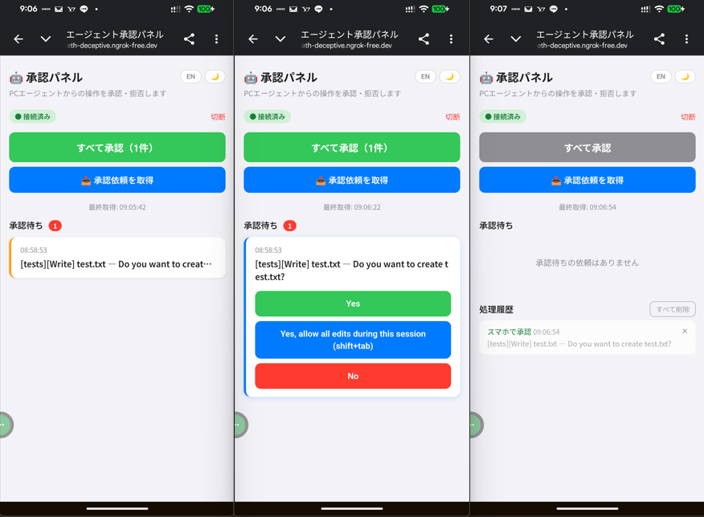
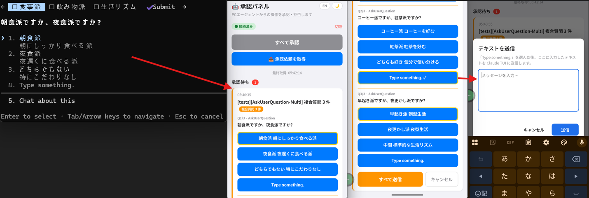

# claude-approval-server

Claude Code と OpenAI codex CLI の承認ダイアログを、PC ターミナルと**スマートフォン（または PC ブラウザ）の両方**から承認・拒否できるようにするツールです。

PTY ラッパーが CLI の入出力を仲介し、ダイアログが出ると

- PC ターミナルに従来どおり表示（1/2/3 キーで応答可能）
- **同時に** スマートフォン／PC ブラウザの承認パネルにも表示

どちらで応答しても、もう一方の表示は自動的に閉じます。



## 特徴

- **Claude Code / codex CLI の設定を変更しない**: hooks や CLI 側の設定には何も書きません。ラッパー経由で `claude` または `codex` を起動するだけで動作し、ラッパーの利用を止めればそのまま元の挙動に戻ります
- **CLI 作業中に離席しても作業を継続できる**: 承認だけスマホ・別 PC から人手で応答できるため、`PreToolUse` フックに自動承認ロジックを書く必要がありません
- **既存設定と非干渉**: PTY の入出力を観察するだけで CLI 内部には介入しないため、既存 hooks や承認設定のある環境にもそのまま追加できます
- **複数プロジェクトを 1 画面に集約**: `[projectName][toolName]` 形式で識別され、並行プロジェクトの依頼が同じスマホ画面に届きます
- **Yes/No 系の承認だけでなく対話的選択にも対応**:
  - Claude Code の AskUserQuestion、複合質問、Type something、プラン承認
  - codex CLI のコマンド承認、プランモード選択肢質問、Tab notes の自由記入

リリースごとの変更点は [RELEASE_NOTES.md](RELEASE_NOTES.md) に分離しています。



PC ターミナル(左)に表示された複合質問が、そのままスマホの承認パネルに転送されます。各タブで通常の選択肢(数字)を選ぶか、Type something を押せばテキスト入力モーダル(右端)が開き、フリーテキストでも回答できます。全タブの回答が揃ったら「すべて送信」で PC TUI へ一括反映、操作を取りやめたいときは隣の「キャンセル」で Esc 相当の破棄ができます。

### hooks 方式との違い

| 観点 | hooks (`PreToolUse` 等) | 本ツール |
|---|---|---|
| 設定変更 | `settings.json` に hook を登録する必要あり | 不要（Claude Code 側に書き込みなし） |
| 離席中の承認 | hook で自動応答ロジックを書く | スマホで人手応答 |
| 既存 hooks との共存 | 競合に注意 | 干渉しない |
| Claude Code 更新追従 | hook 契約変更で壊れることがある | PTY 表示形式の追従だけで済む |

## 公式機能（/dispatch・/remote-control）との違い

Claude Code を遠隔から扱う公式機能として **/dispatch**（Cowork 経由）と **/remote-control**（Claude Code v2.1.51+）が提供されていますが、本ツールは **承認ダイアログのみ** を遠隔化する点で立ち位置が異なります。

| ツール | 遠隔化する対象 | リモート側でできること | 通信経路 | 必要なプラン |
|---|---|---|---|---|
| **本ツール** | 承認ダイアログだけ | Yes / No（1 / 2 / 3 相当） | 自分の PC ⇄ ngrok ⇄ 自分のスマホ | 不要（OSS・自前ホスト） |
| **/dispatch**（Cowork） | 新規タスクの投入口 | 「これやって」と投げる、cron 的なスケジュール投入 | Anthropic クラウド経由 | Claude アカウント |
| **/remote-control** | PC 上で動作中のセッション全体 | プロンプト送信・出力閲覧などほぼフル操作 | Anthropic クラウド経由 | Pro / Max / Team / Enterprise（API キー不可） |

### プロジェクトをまたいで使えるか

複数プロジェクトを並行して走らせる運用では、各機能の挙動が大きく異なります。

- **本ツール**: サーバーと ngrok は 1 組だけ起動し、各プロジェクトで `claude-wrapper.js` を立ち上げれば **すべての依頼が同じ承認パネルに集約** されます（`[projectName][toolName]` 形式で識別）。スマホ 1 画面で複数プロジェクトの承認を一括で捌ける点が最大の強みです。
- **/dispatch**: スマホから投げたタスクごとに Anthropic 側が適切なセッションを spawn します。**プロジェクトごとに別セッション** が立つため、結果はセッションを切り替えて確認する形になります。
- **/remote-control**: 1 つの Claude Code プロセスは 1 つのリモートセッションを持ちます（`claude remote-control` のサーバーモードなら 1 プロセスで最大 32 セッションまで扱えますが、いずれも **同じ cwd を共有** します）。異なるプロジェクトをまたぐ場合は **プロジェクトごとに `claude remote-control` を起動** し、claude.ai/code のセッションリストで切り替える運用になります。

### 使い分けの目安

- **承認だけ外出先で捌きたい、操作は PC で完結している** → 本ツールが最軽量
- **外から新しい仕事を投げて結果だけ受け取りたい** → `/dispatch`
- **外からも腰を据えて Claude Code を操作したい** → `/remote-control`（プラン要件を満たす場合）

3 つは競合というよりレイヤーが違うため、たとえば「PC 上で `/remote-control` を使いつつ、承認だけ本ツールでスマホへ転送」のような併用も技術的には可能です（ただし承認イベントは片方に集約した方が運用上は分かりやすくなります）。

## 構成

```
approval-server.js              承認キューを管理する HTTP サーバー（127.0.0.1 のみに公開）
claude-wrapper.js               Claude Code / codex CLI を PTY で包んでダイアログを検出するラッパー
approval-ui.html                PC ブラウザ・スマートフォン兼用 Web UI
approval-config.example.json    設定ファイルのサンプル
approval-config.codex.example.json codex 用 target 設定を含む設定ファイルのサンプル
approval-config.json            ポートとトークンを保存する設定ファイル（gitignore 済み）
```

## 必要なもの

- Node.js 18 以上（インストール例: [nvm](https://github.com/nvm-sh/nvm)）
- [ngrok](https://ngrok.com/) アカウント（無料枠で動作。インストールと authtoken 登録の手順はセットアップのステップ 4 で説明）
- `node-pty` をネイティブビルドできる環境
  - **Windows**: Python 3 と Visual Studio Build Tools（Desktop development with C++）
  - **macOS**: `xcode-select --install`
  - **Linux**（WSL2 Ubuntu 含む）: `build-essential`（`make` / `g++` / `gcc` を含むメタパッケージ）と `python3`

Node.js 22 など主要バージョンでは事前ビルド済みバイナリが使われる場合もあり、その場合はビルドツールは不要です。

## セットアップ

### 1. クローン＆インストール

```bash
git clone https://github.com/YATA-NODE/claude-approval-server.git
cd claude-approval-server
npm install
```

### 2. 設定ファイルを作成

`approval-config.example.json` を `approval-config.json` にコピーし、`token` を推測困難な長いランダム文字列に書き換えます。

```json
{
  "port": 3000,
  "token": "ここに 32 バイト以上のランダム文字列"
}
```

- `approval-config.json` は `.gitignore` 済みです。公開リポジトリに push されません。
- ポートを変えたい場合は `port` を任意の値に変更してください。
- 設定ファイルを作らなくても、環境変数 `APPROVAL_PORT` / `APPROVAL_TOKEN`、あるいはデフォルト値（ポート 3000・起動ごとにランダム生成されるトークン）で動作します。長期固定したい場合は `approval-config.json` に書く方法も使えます（どちらでも構いません）。
- ラッパー側もサーバーと同じトークンを参照します。サーバーをランダム生成モードで使う場合は、起動時に表示されたトークンを `APPROVAL_TOKEN=xxxx node /path/to/claude-wrapper.js` の形でラッパーに渡してください。
- 優先順位:
  - **PORT**: `APPROVAL_PORT`（env）→ `approval-config.json` の `port` → 3000
  - **TOKEN**: `approval-config.json` の `token` → `APPROVAL_TOKEN`（env）→ 起動ごとのランダム値
  - PORT は env 優先（ポート衝突時などに一時的に切り替えやすい）、TOKEN は config 優先（長期固定値として扱うため、無関係な env で上書きされない）

### 3. 承認サーバーを起動

専用ターミナルを開いて起動します（プロジェクト作業用とは別のターミナル）。

```bash
node approval-server.js
```

起動時にコンソールに `SECRET_TOKEN` が表示されます。この値はスマートフォン UI に入力します。

```
✅ Approval server running on http://127.0.0.1:3000 (loopback only)

🔑 SECRET_TOKEN: xxxxxxxxxxxxxxxxxxxxxxxxxxxxxxxx
```

サーバーは `127.0.0.1` のみにバインドされ、LAN 上の他端末からは直接アクセスできません。外部アクセスは必ず ngrok トンネル経由になります。

### 4. ngrok をセットアップしてトンネルを開く

#### 4-1. 初回のみ: インストールと authtoken 登録

1. [ngrok 公式](https://ngrok.com/download) の手順に従って ngrok をインストール（macOS は `brew install ngrok`、WSL2 / Linux と Windows は公式ページに表示されるコマンドをそのまま実行）
2. [https://dashboard.ngrok.com/signup](https://dashboard.ngrok.com/signup) でアカウントを作成
3. [Your Authtoken](https://dashboard.ngrok.com/get-started/your-authtoken) ページで authtoken をコピー
4. ローカルに登録（一度実行すれば永続化されます）

```bash
ngrok config add-authtoken <YOUR_AUTHTOKEN>
```

#### 4-2. 毎回: トンネルを開く

別のターミナルで実行します。

```bash
ngrok http 3000
```

表示された `https://xxxx.ngrok-free.app` をメモしておきます（スマホ UI に入力します）。

### 5. 承認パネルをブラウザで開く

| 端末 | URL |
|------|-----|
| PC ブラウザ | `http://localhost:3000` |
| スマートフォン | `https://xxxx.ngrok-free.app`（ngrok が表示した URL） |

URL と `SECRET_TOKEN` を入力して接続します。設定は `localStorage` に保存されるので次回以降は自動入力されます。

> WSL2 で承認サーバーを起動した場合も、Windows 側のブラウザから `http://localhost:3000` でそのままアクセスできます（WSL2 の localhost forwarding により）。

### 6. Claude Code / codex CLI をラッパー経由で起動

プロジェクト用ターミナルで **対象プロジェクトに `cd` してから** ラッパーを実行します。コマンドのパスはラッパーの配置場所を指すだけで、対象 CLI は「いま `cd` しているディレクトリ」で起動します。

Claude Code を起動する場合：

```bash
cd /path/to/my-project
node /path/to/claude-approval-server/claude-wrapper.js
```

codex CLI を起動する場合：

```bash
cd /path/to/my-project
APPROVAL_TARGET_CMD=codex node /path/to/claude-approval-server/claude-wrapper.js --ask-for-approval untrusted
```

Windows ネイティブ（cmd / PowerShell）の場合は区切りを `\` に置き換えます。シェルでは単一の `\` で書きます（`\\` のエスケープはソースコード内表記であり、コマンドラインでは不要です）：

```cmd
cd C:\Users\username\my-project
node C:\Users\username\claude-approval-server\claude-wrapper.js
```

シェルにエイリアスを登録しておくと、任意のプロジェクトで `claude` / `codex` と打つだけでラッパー経由起動できます。`CLAUDE_APPROVAL_SERVER_DIR` には、このリポジトリを clone したディレクトリを指定してください。

```bash
# WSL2 / Linux / macOS: ~/.bashrc / ~/.zshrc など
export CLAUDE_APPROVAL_SERVER_DIR="$HOME/path/to/claude-approval-server"
alias claude='node "$CLAUDE_APPROVAL_SERVER_DIR/claude-wrapper.js"'
alias codex='APPROVAL_TARGET_CMD=codex node "$CLAUDE_APPROVAL_SERVER_DIR/claude-wrapper.js" --ask-for-approval untrusted'

# 使い方
cd /path/to/my-project
claude
codex
```

```cmd
:: Windows ネイティブ cmd: %USERPROFILE% 配下に clone した場合
set "CLAUDE_APPROVAL_SERVER_DIR=%USERPROFILE%\path\to\claude-approval-server"
setx CLAUDE_APPROVAL_SERVER_DIR "%USERPROFILE%\path\to\claude-approval-server"
doskey claude=node "%CLAUDE_APPROVAL_SERVER_DIR%\claude-wrapper.js" $*
doskey codex=cmd /C "set APPROVAL_TARGET_CMD=codex&& node ""%CLAUDE_APPROVAL_SERVER_DIR%\claude-wrapper.js"" --ask-for-approval untrusted $*"
```

```powershell
# Windows PowerShell: $PROFILE に追加
$env:CLAUDE_APPROVAL_SERVER_DIR = "$HOME\path\to\claude-approval-server"
function claude { node "$env:CLAUDE_APPROVAL_SERVER_DIR\claude-wrapper.js" @args }
function codex {
  $previous = $env:APPROVAL_TARGET_CMD
  $env:APPROVAL_TARGET_CMD = "codex"
  try { node "$env:CLAUDE_APPROVAL_SERVER_DIR\claude-wrapper.js" --ask-for-approval untrusted @args }
  finally { $env:APPROVAL_TARGET_CMD = $previous }
}
```

起動時にラッパーが認識したプロジェクト名が表示されます。

```
[wrapper] project="my-project" (cwd=/path/to/my-project)
```

以降、Claude Code / codex CLI の承認ダイアログはすべて承認パネルにも転送されます。依頼には `[プロジェクト名][ツール名]` の形式でプロジェクトが表示され、複数プロジェクトを同時に動かしていてもスマホ側でどこから来た依頼か識別できます。

## 毎回の起動・停止手順

初回以降は以下の順で操作します。

### 起動順序

1. **ターミナル A** — 承認サーバー `node approval-server.js`
2. **ターミナル B** — `ngrok http 3000`
3. スマホ／PC ブラウザで承認パネルに接続
4. **ターミナル C 以降** — プロジェクトに `cd` してから、Claude Code は `claude`、codex CLI は `codex` エイリアスで起動。複数プロジェクト / 複数 CLI を同時に立ち上げて OK で、依頼はすべて同じ承認パネルに集まります（`[projectName]` prefix で識別）

### 停止順序

1. 各ラッパー（Claude Code / codex CLI）を終了（`/exit` または `Ctrl+C`）
2. ngrok を停止（`Ctrl+C`）← **先に止める**（外部アクセスを閉じる）
3. 承認サーバーを停止（`Ctrl+C`）

## 仕組み

```
┌──────────────┐         ┌──────────────────┐         ┌────────────┐
│ Claude/codex │ ─PTY─→ │  claude-wrapper  │ ─HTTP→ │  approval- │
│     TUI      │ ←─────  │      .js         │ ←──────  │  server.js │
└──────────────┘         └──────────────────┘         └─────┬──────┘
                                                            │ ngrok
                                                            ↓
                                                      ┌──────────────┐
                                                      │ Smartphone / │
                                                      │ PC browser   │
                                                      └──────────────┘
```

1. ラッパーが PTY 出力から `Do you want to ...?` を検出
2. approval-server に `POST /request` を送り、id を受け取る
3. スマホ／PC ブラウザが `GET /queue` で取得し UI に表示
4. どこかで応答（`POST /resolve/:id`）が入ると、サーバーの long-poll が即座に返答
5. ラッパーが対象 CLI に合わせて番号、Enter、ショートカットキーなどを PTY に注入し、CLI 本体が続行
6. 逆に PC ターミナルで直接応答された場合、ラッパーはダイアログ消失を検知して `resolvedBy=cli` で resolve。スマホ側の表示も閉じる
7. UI の「すべて削除」操作で `DELETE /history`(認証必須)を呼ぶと、サーバーは resolved 済みのキューエントリのみを一括削除し `{ removed }`(削除件数)を返す。pending なエントリには影響しない

## セキュリティ

- **127.0.0.1 バインド**: 承認サーバーはループバックのみ受け付け、外部アクセスは ngrok 経由のみ
- **トークン認証**: 全 API で `x-secret-token` ヘッダー必須。`crypto.timingSafeEqual` でタイミング攻撃に耐性あり
- **レート制限**: 認証失敗が 60 秒あたり 10 回を超えた IP は 10 分間ブロック
- **入力サニタイズ**: `description` は 500 文字、`options` は 9 件 × 200 文字、複合質問の `tabs` は 9 件(label 100 文字 / prompt 500 文字)、`answers` は 9 件まで。余剰は切り詰め(件数超過は破棄)
- **注入ホワイトリスト**: PTY に書き込まれるのは以下のいずれかのみ。任意キー注入を構造的に防止
  - 数字 `1`〜`9`(選択肢番号)
  - `options` の値と完全一致する回答(完全一致を検証したうえで対応する 1 始まりの番号の文字列に正規化して注入。一致した文字列そのものは書き込まれない)
  - `Type something` 経路の text(制御文字 C0+DEL+C1 を 3 層 reject、最大 2000 文字)
  - cancel 経路の `\x1b`(Esc キー、wrapper 内部生成のみ)
  - codex のコマンド承認確定キー(option ラベル末尾の `(y)`/`(p)`/`(esc)` から抽出した単一英数字 1 文字 or `\x1b`)。抽出不能なら注入せず再登録(誤確定防止)
- **option 種別検証**: text 添付は `Type something` option、または wrapper が自由記入可と宣言した codex option(ラベル末尾が `(tab)` の Tab notes 選択肢)を選んだ場合のみ許可。それ以外の選択肢への text 添付は server / wrapper 両方で reject(defense in depth)
- **`Chat about this` 完全防御**: 遠隔不能仕様(数字キーで選べず、選ぶとダイアログ全体を抜けて通常チャットへ移行)のため、UI から除外 + サーバで 4 経路全て reject(options[idx] / answer 数字指定 / answer 文字列完全一致 / Multi `{num,text}`)。代替として「キャンセル」ボタンを提供
- **静的配信の絞り込み**: `/` での `approval-ui.html` 配信のみ許可し、`approval-config.json` 等への直接アクセスは 404
- **ログ非露出**: フリーテキストの本文は server コンソール / wrapper wlog / UI 履歴サマリのいずれにも残さず、長さのみ記録。履歴カードのタップ展開時のみブラウザメモリ上の本文を再表示します(localStorage 不使用 = リロード or タブ閉じ or 1 時間 TTL で消失)
- **設定ファイル**: `approval-config.json` は `.gitignore` 済み + 上記の通り配信もされません
- **ngrok URL 漏洩対策**: ngrok URL は毎セッション変わります。使用後はトンネルを閉じてください

> ⚠️ **権限拡張の注記**: 上記の防御層により注入経路は厳格にホワイトリスト化されていますが、本ツールの認証トークン(`approval-config.json` 内の値)を保持している人は **`Type something` 経路、および codex の Tab notes(自由記入)経路を通じて対象 CLI に任意テキストを送信できます**。トークンの取り扱い(共有しない / セッション後の `approval-config.json` 削除)に注意してください。送信した本文は同一ブラウザのメモリ内に最大 1 時間残ります(履歴展開で表示可能)。共有端末で使う場合は使用後にタブを閉じてください。

> ⚠️ **残っているリスクの注記**: 上の防御層は「スマホから何が送れるか」を絞るものです。
> これとは別に、**ラベルの無い承認枠（`WebFetch` 系）では、スマホに出る表示をすり替えられる
> 余地**が残っています（唯一の手掛かりである `● Tool(...)` 行は、モデルが作れるため）。
> `WebFetch` の枠は実測では検出されずそもそもスマホに出ません。MCP の承認枠は v1.20.0 から
> ラベル行（`Tool use`）で同定して対象を読み取るようになり、同定できない枠は転送されなくなり
> ました（fail-close）。内容と現時点の運用は
> [承認の表示内容は「承認枠の中身」から読みます](#承認の表示内容は承認枠の中身から読みます)
> の「このバージョンで塞ぎ切れていないこと」③ を参照してください。

## スマートフォン UI の機能

- 承認待ちキューの一覧表示（手動取得）
- 個別・一括の承認／拒否
- **選択肢ダイアログ対応**: Claude Code / codex CLI の選択肢ダイアログを通常の Yes/No 系と区別して表示
- **複合質問のタブ式承認**: 1 ダイアログにまとめられた複数質問を各タブごとに回答 → 「すべて送信」で一括反映
- **テキスト入力モーダル**: `Type something` や codex の Tab notes を選ぶと textarea モーダルが開き、スマホからフリーテキストを送信。単一質問・複合質問の両方で対応(複合質問は各タブの回答揃い次第「すべて送信」で一括反映)
- **キャンセルボタン**: 「すべて送信」横 / 単一質問のボタン群末尾に表示。押下で wrapper が PC TUI に Esc キーを注入してダイアログを破棄
- 履歴表示（直近 20 件、承認元が `PC` / `スマホ` / `CLI` で識別可能。フリーテキストはサマリでは長さのみ表示し、複合質問 / フリーテキスト履歴のみ履歴カードをタップで展開して各タブの選択肢 / 入力本文をブラウザメモリから表示可能 = リロード or 1 時間 TTL で消失)
- プロジェクト識別（`[プロジェクト名][ツール名] 引数 — プロンプト` 形式で表示）
- 日本語 / 英語 切替
- ダーク / ライト テーマ切替

## 複数プロジェクト同時利用

サーバーと ngrok は 1 組だけ起動し、各プロジェクト用ターミナルで `cd` してからラッパーを起動します。

```
ターミナル A: node approval-server.js           ← 1 回だけ
ターミナル B: ngrok http 3000                   ← 1 回だけ
ターミナル C: cd /path/to/project-a && claude
ターミナル D: cd /path/to/project-b && codex
```

依頼はすべて同じ承認パネルに集まり、`[project-a][Bash] ...` / `[project-b][Write] ...` のようにプロジェクト名で識別できます。プロジェクト名はラッパーの cwd（`process.cwd()` の basename）から自動取得されます。

## codex CLI の使い方

OpenAI の **codex CLI** もラッパー経由で起動でき、codex の **コマンド承認**（`Would you like to run the following command?`）をスマホから承認 / 拒否できます。

```bash
cd /path/to/my-project
APPROVAL_TARGET_CMD=codex node /path/to/claude-approval-server/claude-wrapper.js --ask-for-approval untrusted
```

- `APPROVAL_TARGET_CMD=codex` で起動対象を codex に切り替えます（既定は `claude`）。`--ask-for-approval untrusted` など、codex 側に承認を要求させるフラグが必要です（素の codex は自動実行で承認ダイアログが出ません）。
- 普段使いでは、上のセットアップ手順のように `codex` エイリアス / 関数を登録しておくのがおすすめです。以後は対象プロジェクトで `codex` と打つだけでラッパー経由起動できます。追加引数（例: `codex --model ...`）もそのまま codex CLI に渡されます。
- **サーバーと ngrok は claude と共有**できます（同じ `port` / `token`）。複数の wrapper（claude / codex）が 1 つの承認パネルに集まり、`[projectName]` で識別されます。2 台目のサーバー / ngrok は不要です。
- 承認の注入は codex 流のショートカットキー（option ラベル末尾の `(y)` / `(p)` / `(esc)`）で行います。番号ではなくキーで確定するため、claude の「番号 + Enter」とは別経路です。
- コマンド承認はスマホ上で `[projectName][Bash] <コマンド本文> — Would you like to run…?` のように、実行されるコマンド本文付きで表示されます。本文を確証できない描画途中フレームは承認可能化されず、完全に描画されてから表示されます。
- 設定ファイルで固定したい場合は `approval-config.codex.example.json` を参考にしてください（`target.command` に `codex` を指定）。

### プランモードの選択肢質問

codex の **プランモードで出る選択肢質問**（`Question 1/1` … = claude の AskUserQuestion 相当）もスマホから回答できます。スマホで選択肢をタップすると、番号で選択 → Enter で確定します。終端マーカー（`enter to submit answer`）を既定で検出するため、追加設定は不要です。

- **対応**:
  - 単一質問（`Question 1/1`）の選択肢回答。
  - **複数質問フロー**（`Question 1/N` … = codex が複数問に分割した場合。`←/→` で巡回し最後に `enter to submit all`）。スマホに全問がタブ表示され、全問回答 → 「すべて送信」で一括確定します。先頭 1 問だけ中途半端に確定する事故は構造的に防いでいます。
  - **自由記入（Tab notes）**: `None of the above ... add details in notes (tab)` のような選択肢からスマホのテキスト入力を開き、入力本文を PC 側の codex に送信できます。
- **補足（codex のラウンド分割）**: codex は 1 つの依頼を複数ラウンドに分割することがあります（例: 4 つの選択を「3 問バッチ + 後から 1 問」に分ける）。各ラウンドは順にスマホへ送られるので、ラウンドごとに承認してください（スマホで「📥 承認依頼を取得」すると次のラウンドが現れます）。

## トラブルシューティング

### `npm install` が `node-pty` のビルドで失敗する

OS ごとのビルド環境を確認してください。

- **Windows**: Python 3 と Visual Studio Build Tools（Desktop development with C++）をインストール
- **macOS**: `xcode-select --install` を実行
- **Linux**（WSL2 Ubuntu 含む）: `sudo apt install build-essential python3`（`build-essential` は `make` / `g++` / `gcc` を含むメタパッケージ）

### スマホに承認依頼が届かない

1. `approval-config.json` の `port` と `ngrok` のポート番号が一致しているか
2. 承認サーバー起動時のコンソール表示に `SECRET_TOKEN` が出ているか、スマホ UI に入れたトークンと一致しているか
3. ngrok の URL が正しいか（セッションごとに変わります）

### PC ターミナルのダイアログが承認パネルに転送されない

`claude` / `codex` の素のコマンドではなく、`claude-wrapper.js` 経由で対象 CLI を起動しているか確認してください。ラッパー外で起動したセッションは対象外です。

### ツール名が `[Unknown]` と表示されることがある

**v1.19.x までの挙動です。** PTY はダイアログを複数フレームに分けて描画します。ツール名を含む `● Tool(args)` 行がプロンプトより遅れて届くと、先に検出した「プロンプトのみ」のフレームで依頼を登録し、同一ダイアログの再描画は dedup で無視するため、サーバー側の表示は `[Unknown]` のままになります。承認・拒否の動作には影響しません。重複登録の発生よりもこちらを許容する設計です。**v1.20.0 からはツールを同定できないフレームを転送しないため、新規の依頼が `[Unknown]` になることはありません。**

### スマホ側のオプション表示で空白が詰まって見える

例: `Yes,allowalleditsduringthissession(shift+tab)` のように単語間の空白が消えた状態で表示されることがあります。これは Claude Code v2.1.x 以降のダイアログが ANSI カーソル制御で部分再描画される影響で、PTY 上で空白文字が落ちるために起きます。承認・拒否の動作には影響しません（注入は番号 1/2/3 で行うため）。

### 承認依頼がスマホに届かない（Claude Code を更新後）

Claude Code 本体のダイアログ書式が変わって検出が壊れた場合は、`approval-config.json` の `dialogDetection.endMarkers.default` で終端マーカーの正規表現を上書きすることで暫定対処できます:

```json
{
  "port": 3000,
  "token": "...",
  "dialogDetection": { "endMarkers": { "default": "新しい終端文字列の正規表現" } }
}
```

旧形式の `dialogDetection.endMarker`（文字列）も動作しますが非推奨で、起動時に警告が出ます。ExitPlanMode や codex 質問型のマーカーは自動で OR されるため、通常は `default` だけを上書きすれば足ります。

### タブ式の複合質問でタブが動くのが気になる

複数質問をまとめたタブ式ダイアログは、各タブの中身を読む手段が「実際に Tab キーを送ってそのタブへ移動する」しかないため、検出時に一度だけタブを巡回します（v1.19.0 以降、1 回の出現につき 1 回だけ・巡回中に PC で操作すると即中断）。巡回そのものを止めたい場合は `dialogDetection.tabSweep` に `false` を設定します。タブ式ダイアログはスマホへ転送されなくなり、PC で回答することになります（単一質問の転送は従来どおり）。この設定は codex CLI の複数質問（`Question N/M`）の巡回にも同じように効くため、`false` にすると codex の複数質問もスマホへ転送されなくなります。

v1.19.0 以降、**巡回はタブバーが出現時から動いていないときだけ始まります**。PC 側で 1 問でも答えるとタブバーの表示が変わるため、以降そのダイアログにはキーを送らず、スマホへも転送されません(PC で回答することになります)。スマホで回答したい場合は、ダイアログが出てから 1〜2 秒ほど PC 側で操作せずに待ってください。

なお v1.19.0 以降、タブバーは画面下端のフッタを起点に探します。画面にタブバーらしい行が複数見えて本物を特定できないときは、キーを 1 バイトも送らずに転送を諦めます（PC で回答してください）。この状態はラッパーのログに `tab bar ambiguous` として記録されます。

さらに v1.19.0 以降、**巡回は「タブバー行に背景色のセルがある」ときだけ始まります**。会話ログに**背景色を持たない**タブバーらしい行とタブ移動のヒントが流れているだけの状態ではキーを一切送りません（Claude が素のテキストや markdown 装飾で出した文章だけで巡回が始まり、通常の入力欄へ Shift+Tab が送られるのを防ぐため）。**ただし Bash の `printf` で生の ANSI エスケープを通した経路では、この条件が成立することを実測しました**（他のツール・他の出力経路は未確認。下の「この判定の保証範囲」を参照）。判定にはタブバー行のセル属性（選択中タブの背景色）を使うため、**背景色を報告しない端末ではタブ式がスマホへ転送されません**（PC で回答してください）。この状態はログに `タブバーが CLI 描画でない` として記録されます。

> **この判定の保証範囲（2026-08-14 の実測で更新）**
>
> **背景色のセルがあることは「真正な CLI のタブバー UI 行」である証明にはなりません。** この判定は、真正なタブバー行と「背景色が付いた別の行」を区別できません。実測環境では、モデルが通常の会話ログへ出した素のテキストや markdown 装飾だけでは判定を通せませんでしたが、**同じ文字列でも背景色付きの行として描かれれば通ります**。確認した 2 経路:
>
> | 経路 | 誰が中身を決めるか | 判定の突破 | 実際のキー送信 |
> |---|---|---|---|
> | ① Bash の `printf` で生の ANSI エスケープ（背景色）を実行結果として画面へ通す | **モデル**（実行内容を書くのはモデル） | **確認済み** | **未確認** |
> | ② 色付き出力を使わず、CLI 自身が背景色付きで描くプロンプトのエコー行 | 利用者（あなたが打った文字列） | 確認済み | 未確認 |
>
> ①は**モデルが中身を決められる**ので攻撃面になりえますが、確認できたのは「判定を突破するところまで」で、そこから実際にキーが送られるところまでは確認していません。
>
> ②は攻撃経路ではありませんが、**「背景色 = 真正なタブバー」という前提が成り立たないことの反証**です。
>
> **どこまで実測したか（誤読を避けるため）**: 確認したのは **録画を再生してこの判定（`barRowHasStyledCells`(旧称 `barRowIsCliDrawn`)）が `true` になるところまで**です。**実機で巡回が起動して実際にキーが送られるところまでは確認していません**（別の条件も通る必要があるため）。また、背景色があればどんな行でも通るわけではなく、その行が**タブ印を 2 つ以上含み `Submit` を含み選択肢行でない**という条件も同時に満たし、かつ画面内で**候補が 1 本だけ**である必要があります。測定環境は Claude Code 2.1.226 系 / WSL2 / `TERM=xterm-256color` / node v20 / `@xterm/headless` 6.0.0 の 1 つのみ。他の制御列（DCS / C1 / BS など）、他の tool 経由の出力、他の CLI バージョンは未測定です。
>
> ⚠️ **未信頼の内容を扱う場合の推奨**: モデルが読む・実行するものに他人が用意した内容（外部から取得したファイル、Web の内容、他人のリポジトリ等）が混ざりうる運用、つまり**プロンプトインジェクションを想定する場合**は、**`dialogDetection.tabSweep` に `false` を設定して巡回を止め、タブ式の質問は PC で回答してください**。対象は 2 経路あります。**claude 側**は上の経路①（モデルが色付き出力でこの判定を通せる)、**codex 側**は「既知の制約」⑤のとおり**巡回の起動判断に CLI 描画の確認そのものが無く画面の文字列だけに依存する**ため、いずれも同じ設定で止めます。

```json
{
  "port": 3000,
  "token": "...",
  "dialogDetection": { "tabSweep": false }
}
```

### 承認の表示内容は「承認枠の中身」から読みます

v1.19.0 以降、ツール名とコマンドは **承認枠の中に描かれたコマンド本文**（`Bash command` / `Run command` ラベルの下）から読み取ります。`● Tool(...)` 行を使うのは、その行が**承認枠の罫線に密着している**ときだけです。枠から離れた行（前のターンの残りや、コマンド本文の中に書かれた `● Read(...)`）を採用すると、スマホの表示と実際に承認される内容がずれるためです。**承認枠の外**（枠の上に流れている会話ログ）は表示の材料にしません。

**コマンド本文がまだ描かれていないフレームは転送しません**（次に画面が描き直された時点で通常どおり転送されます）。実行内容が空欄のまま、あるいは質問文が「コマンド」として並んだ状態で承認できてしまうのを防ぐためです。

また、スマホからの回答を注入する直前に、**いま表示領域に出ているダイアログが依頼と同じ相手か**を確かめます（v1.19.0 以降、タブ式だけでなく通常の 1 問形式にも適用）。質問文・選択肢の並び・ツール名とコマンドに加えて、**スマホに出した 1 行そのもの**を作り直して突き合わせます。質問文の照合は、長い質問文で末尾だけ違う別の承認を取り違えないよう**完全一致**に限定します（末尾の置換も追記も弾きます）。違っていた場合や画面を読み取れない場合は 1 バイトも注入せず、依頼をスマホへ出し直します（ログは `inject aborted`）。スマホからのキャンセル（Esc）も、タブ式を含めて同じ確認を通ります（タブ式はタブバーの指紋照合のみで、キーは送りません）。

**承認枠の同定が曖昧なフレームは転送しません**。罫線もラベルもモデルが本文に書ける文字なので、コマンド本文の中に「罫線だけの行 + `Bash command` + 無害なコマンド」を書くと枠の境界をずらせます（実際のコマンドが 1 文字も出ないまま承認できました）。**ラベルらしい行が 2 つ以上見えるフレームは転送しません**。また 500 文字を超えるコマンド本文も転送しません（切ると別コマンドが同じ表示・同じ依頼に潰れるため）。いずれも PC 側では従来どおり回答できます。

**v1.20.0 以降、MCP ツールの承認枠（ラベル行 `Tool use`）も同定できるようになりました**。`tool='MCP'` として、枠内に描かれた対象行（`サーバ名 - ツール名(引数)`）を読み取ります。実測は 2 サーバ × 3 ツールでラベルが verbatim 一致した範囲です（他ベンダ製サーバ・ロケール差・CLI バージョン依存は未確認）。あわせて、**ラベルでも `● Tool(...)` 行でも同定できず tool が確定しない承認枠は転送しなくなりました（fail-close）**。従来 `tool='Unknown'` のまま転送されていたこの残余は、このバージョンからスマホに出なくなり、PC 側での操作が必要になります。

**このバージョンで塞ぎ切れていないこと**: ①端末の折り返しで作られる「偽の行頭」②タブバーが CLI 描画かの判定が背景色依存で、**実測で 2 経路の反例が確認されていること**（色付きのコマンド出力を通す経路 / CLI 自身が描くプロンプトのエコー行。上の「この判定の保証範囲」を参照）③**ラベルの無い承認枠（`WebFetch` 系）では `● Tool(...)` 行が唯一の手掛かりで、その行はモデルが作れるため表示をすり替えられる余地が残ること**（ただし画面のどこかに `Bash command` 等の見出し語が 1 行でも残っていると、枠の切り出し失敗と区別できないため転送しません。この見出し語の検知は画面＝表示領域 + スクロールバック 40 行の範囲に限られ、本文を長くして見出し語を画面外へ押し出すとこの fail-close は外れます＝実行確認、ただしそこから実機で表示すり替えに至るかは未確認。実機で確認した範囲では `WebFetch` の枠は終端マーカーを持たずそもそも検出されません（従来どおり 1 例の観測）。**MCP の枠は v1.20.0 からラベル行で同定して対象を読み取ります**（詳細は上記「v1.20.0 以降、MCP ツールの承認枠…」を参照）。ラベルでも `● Tool(...)` 行でも同定できない枠は転送しません（fail-close、同参照）④承認枠の同定がテキストのみに依存していること（セル属性による同定は次のリリース）⑤巡回中の「戻す一手」だけは属性を確認せずに送られること(claude)。**codex の複数質問では巡回キー(←/→)に CLI 描画の確認そのものが無いこと**(タブバーという CLI 描画の証拠を持たないため、巡回の起動判断が画面の文字列だけに依存する) ⑥説明行を含めて表示するため、描画の進行中に依頼が出し直されることがあること ⑦**折り返した質問文の前半がコマンド本文として表示され、端末幅が変わると同じ承認が別依頼として出し直されうること** ⑧**コマンド本文の引用符（`"` / `'`）が奇数個で閉じていない承認枠は転送しないこと**（ラベルの無い枠でのみ発生、fail-close）⑨**codex の複数質問フロー（`Question 1/N`）ではスマホからのキャンセル（Esc）が送られず PC 側の操作になること**（承認・拒否の回答はスマホから可能）⑩**（v1.20.0 で解消）ラベルの無い承認枠は対象を読み取れないため、実行内容が違っても同一の依頼と判定される余地があったこと**。MCP の承認枠は v1.20.0 からラベル行で対象を読み取るため、引数だけが異なる連続した MCP 承認は別の依頼として扱われます（引数の異なる 2 枠を同一性判定に掛けると別ダイアログと判定されることを実行で確認済み）。同定できない枠はそもそも転送されなくなった（fail-close、上記参照）ため、読み取れないまま同一視される経路自体がなくなりました。

## 対応プラットフォーム

| 項目 | 確認済み | 未確認 |
|------|----------|--------|
| OS | Windows 11、Linux（WSL2 Ubuntu） | macOS、ネイティブ Linux |
| Node.js | v20.20.2、v22 | その他のバージョン |
| Claude Code | CLI | — |
| codex CLI | CLI | — |
| スマホブラウザ | iOS Safari、Android Chrome | その他 |

※ **タブ式（claude の ☐/✔ タブ UI）の転送は、PC 側のターミナルが背景色を報告することに依存します。** 選択中タブ相当の行に背景色のセルがあることを巡回の起動条件にしているためです（この条件は**真正な CLI のタブバー UI 行であることを保証しません**。上の「この判定の保証範囲」を参照）。背景色を報告しないターミナルではタブ式ダイアログがスマホへ転送されません（PC で回答してください）。単一質問の転送は影響を受けません。**codex CLI の複数質問（`Question N/M`）はタブバーを持たずこの判定を通らないため、背景色を報告しないターミナルでも転送されます**（止めたい場合は `dialogDetection.tabSweep` に `false` を設定してください）。詳細はトラブルシューティングの「タブ式の複合質問でタブが動くのが気になる」を参照してください。

## ライセンス

MIT License — Copyright (c) 2026 sta29697

使用ライブラリのライセンス:
- [express](https://github.com/expressjs/express) — MIT
- [cors](https://github.com/expressjs/cors) — MIT
- [node-pty](https://github.com/microsoft/node-pty) — MIT

---

# claude-approval-server (English)

A tool that forwards Claude Code and OpenAI codex CLI approval dialogs to **both the PC terminal and a smartphone (or PC browser)**, letting you approve or reject from either side.

A PTY wrapper sits between the CLI and the terminal: when an approval dialog appears,

- it is shown in the PC terminal as usual (press `1` / `2` / `3`), and
- **simultaneously** pushed to the approval panel on smartphone / PC browser.

Whichever side responds first dismisses the other side automatically.


## Highlights

- **Zero changes to Claude Code / codex CLI config**: nothing is written to hooks or CLI config. Use the wrapper in place of `claude` or `codex`; stop using it and you're back to the default behavior immediately
- **Keep working in the CLI even when you step away**: a human can answer approvals from a phone or another PC, so you don't need to script auto-approval logic in a `PreToolUse` hook
- **Coexists with existing settings**: the wrapper only observes PTY I/O; CLI internals are not touched, so it slots into setups that already have hooks or approval settings
- **One screen for every project**: requests are tagged `[projectName][toolName]` so concurrent projects share the same approval panel
- **Beyond Yes/No: interactive choice dialogs**:
  - Claude Code AskUserQuestion, multi-tab questions, Type something, and plan approval
  - codex CLI command approvals, plan-mode choice questions, and free text via Tab notes

Version-specific changes live in [RELEASE_NOTES.md](RELEASE_NOTES.md).


A multi-tab dialog shown in the PC terminal (left) is forwarded as-is to the approval panel. Each tab accepts a numeric choice, or pressing **Type something** opens the free-text modal (right) so the answer can be a typed message. Once every tab is filled, **Submit all** applies the responses to the PC TUI in one go; the neighbouring **Cancel** button dismisses the whole dialog (Esc-equivalent) if you change your mind.

### vs hooks-based approaches

| Aspect | hooks (`PreToolUse` etc.) | This tool |
|---|---|---|
| Configuration | Register a hook in `settings.json` | None (nothing written to Claude Code) |
| Approving while away | Script the auto-response in the hook | A human answers on the phone |
| Coexistence with other hooks | Conflicts to watch out for | No interference |
| Tracking Claude Code updates | Hook contract changes can break it | Only the PTY rendering needs to follow |

## How this differs from the official `/dispatch` and `/remote-control`

Claude Code now ships two official ways to use it remotely — **/dispatch** (via Cowork) and **/remote-control** (Claude Code v2.1.51+). This tool occupies a different niche: it forwards **only the approval dialog**, nothing else.

| Tool | What it forwards | What you can do remotely | Transport | Plan |
|---|---|---|---|---|
| **This tool** | Approval dialogs only | Yes / No (1 / 2 / 3) | Your PC ⇄ ngrok ⇄ your phone | None (OSS, self-hosted) |
| **/dispatch** (Cowork) | Submission of new tasks | "Do this for me", cron-style scheduling | Through Anthropic cloud | Claude account |
| **/remote-control** | The full session running on your PC | Send prompts, view output, near-full control | Through Anthropic cloud | Pro / Max / Team / Enterprise (no API key) |

### Working across multiple projects

How each option handles parallel projects differs significantly.

- **This tool**: run the server and ngrok once, then launch `claude-wrapper.js` from inside each project. **All requests aggregate into the same approval panel**, tagged as `[projectName][toolName]`. Handling approvals from every concurrently running project on a single phone screen is the headline feature.
- **/dispatch**: every task you send from the phone causes Anthropic to spawn an appropriate session. **Each project ends up in its own session**, so you switch between sessions in the app to check results.
- **/remote-control**: one Claude Code process owns one remote session (server mode `claude remote-control` can host up to 32 sessions per process, but they all **share the same cwd**). For distinct projects you start `claude remote-control` **once per project** and switch between them in the claude.ai/code session list.

### Which one to pick

- **You just want to handle approvals from your phone while everything else stays on the PC** → this tool is the lightest option.
- **You want to fire off new tasks from your phone and get results back** → `/dispatch`.
- **You want full interactive control from outside** → `/remote-control` (if your plan qualifies).

The three are not competitors so much as different layers, so combinations like "drive the session via `/remote-control` on the road, with approvals mirrored to your phone via this tool" are technically possible — though in practice it's cleaner to route approval events through one channel only.

## Structure

```
approval-server.js              HTTP server that manages the approval queue (bound to 127.0.0.1 only)
claude-wrapper.js               Wraps Claude Code / codex CLI via PTY and detects approval dialogs
approval-ui.html                Web UI shared by PC browser and smartphone
approval-config.example.json    Sample config file
approval-config.codex.example.json Sample config file with a codex target
approval-config.json            Your local config (port + token); gitignored
```

## Requirements

- Node.js 18+ (install example: [nvm](https://github.com/nvm-sh/nvm))
- [ngrok](https://ngrok.com/) account (free tier is fine; install + authtoken steps are covered in setup step 4 below)
- A toolchain that can build `node-pty`
  - **Windows**: Python 3 and Visual Studio Build Tools (Desktop development with C++)
  - **macOS**: `xcode-select --install`
  - **Linux** (incl. WSL2 Ubuntu): `build-essential` (a metapackage that bundles `make` / `g++` / `gcc`) and `python3`

Prebuilt binaries exist for common Node versions (e.g. 22), so in practice you often do not need to build.

## Setup

### 1. Clone and install

```bash
git clone https://github.com/YATA-NODE/claude-approval-server.git
cd claude-approval-server
npm install
```

### 2. Create a config file

Copy `approval-config.example.json` to `approval-config.json` and replace `token` with a long random string.

```json
{
  "port": 3000,
  "token": "REPLACE-WITH-A-32-BYTE-RANDOM-STRING"
}
```

- `approval-config.json` is gitignored; your token never leaves your machine.
- You can also use the environment variables `APPROVAL_PORT` / `APPROVAL_TOKEN`, or the defaults (port 3000 and a freshly random token each start). If you'd rather pin a long-term value, putting it in `approval-config.json` works too — both styles are supported.
- The wrapper reads the same token as the server. If you run the server in random-token mode, pass the token printed at startup to the wrapper as `APPROVAL_TOKEN=xxxx node /path/to/claude-wrapper.js`.
- Resolution order:
  - **PORT**: `APPROVAL_PORT` (env) → `approval-config.json` `port` → `3000`
  - **TOKEN**: `approval-config.json` `token` → `APPROVAL_TOKEN` (env) → random value per start
  - PORT favors env so you can override on a per-session basis (port collisions, multi-instance). TOKEN favors the config file so a stray env var cannot shadow your long-term secret.

### 3. Start the approval server

Open a dedicated terminal (separate from your project terminals) and run:

```bash
node approval-server.js
```

The console prints `SECRET_TOKEN` at startup — you will enter this value in the smartphone UI.

```
✅ Approval server running on http://127.0.0.1:3000 (loopback only)

🔑 SECRET_TOKEN: xxxxxxxxxxxxxxxxxxxxxxxxxxxxxxxx
```

The server binds to `127.0.0.1` only; other devices on the LAN cannot reach it directly. External access must go through ngrok.

### 4. Set up ngrok and open the tunnel

#### 4-1. First time only: install and register the authtoken

1. Install ngrok via [the official download page](https://ngrok.com/download) (`brew install ngrok` on macOS; WSL2 / Linux and Windows have copy-paste commands on that page).
2. Sign up at [https://dashboard.ngrok.com/signup](https://dashboard.ngrok.com/signup).
3. Copy your authtoken from [Your Authtoken](https://dashboard.ngrok.com/get-started/your-authtoken).
4. Register it locally (run once; the token is persisted):

```bash
ngrok config add-authtoken <YOUR_AUTHTOKEN>
```

#### 4-2. Each time: open the tunnel

In another terminal:

```bash
ngrok http 3000
```

Note the `https://xxxx.ngrok-free.app` URL — you'll enter it in the smartphone UI.

### 5. Open the approval panel

| Device | URL |
|--------|-----|
| PC browser | `http://localhost:3000` |
| Smartphone | `https://xxxx.ngrok-free.app` |

Enter the URL and `SECRET_TOKEN` to connect. Values are stored in `localStorage` and auto-filled on subsequent visits.

> If you run the approval server inside WSL2, the Windows-side browser can still open `http://localhost:3000` directly thanks to WSL2's localhost forwarding.

### 6. Launch Claude Code / codex CLI through the wrapper

In your project terminal, **`cd` into the target project first**, then run the wrapper. The path on the command line merely points at the wrapper's install location; the target CLI starts in whichever directory you are currently `cd`-ed into.

Launch Claude Code:

```bash
cd /path/to/my-project
node /path/to/claude-approval-server/claude-wrapper.js
```

Launch codex CLI:

```bash
cd /path/to/my-project
APPROVAL_TARGET_CMD=codex node /path/to/claude-approval-server/claude-wrapper.js --ask-for-approval untrusted
```

Native Windows (cmd / PowerShell) — use `\` as the separator. A single `\` is correct on the command line; the doubled `\\` is only an in-source escape, not a shell requirement:

```cmd
cd C:\Users\username\my-project
node C:\Users\username\claude-approval-server\claude-wrapper.js
```

Aliasing makes it a one-word command in any project. Set `CLAUDE_APPROVAL_SERVER_DIR` to the directory where you cloned this repository.

```bash
# WSL2 / Linux / macOS: ~/.bashrc / ~/.zshrc
export CLAUDE_APPROVAL_SERVER_DIR="$HOME/path/to/claude-approval-server"
alias claude='node "$CLAUDE_APPROVAL_SERVER_DIR/claude-wrapper.js"'
alias codex='APPROVAL_TARGET_CMD=codex node "$CLAUDE_APPROVAL_SERVER_DIR/claude-wrapper.js" --ask-for-approval untrusted'

# Usage
cd /path/to/my-project
claude
codex
```

```cmd
:: Native Windows cmd: if cloned somewhere under %USERPROFILE%
set "CLAUDE_APPROVAL_SERVER_DIR=%USERPROFILE%\path\to\claude-approval-server"
setx CLAUDE_APPROVAL_SERVER_DIR "%USERPROFILE%\path\to\claude-approval-server"
doskey claude=node "%CLAUDE_APPROVAL_SERVER_DIR%\claude-wrapper.js" $*
doskey codex=cmd /C "set APPROVAL_TARGET_CMD=codex&& node ""%CLAUDE_APPROVAL_SERVER_DIR%\claude-wrapper.js"" --ask-for-approval untrusted $*"
```

```powershell
# Windows PowerShell: add to $PROFILE
$env:CLAUDE_APPROVAL_SERVER_DIR = "$HOME\path\to\claude-approval-server"
function claude { node "$env:CLAUDE_APPROVAL_SERVER_DIR\claude-wrapper.js" @args }
function codex {
  $previous = $env:APPROVAL_TARGET_CMD
  $env:APPROVAL_TARGET_CMD = "codex"
  try { node "$env:CLAUDE_APPROVAL_SERVER_DIR\claude-wrapper.js" --ask-for-approval untrusted @args }
  finally { $env:APPROVAL_TARGET_CMD = $previous }
}
```

At startup the wrapper prints the project name it picked up:

```
[wrapper] project="my-project" (cwd=/path/to/my-project)
```

From then on, every Claude Code / codex CLI approval dialog is mirrored to the approval panel, prefixed with `[projectName][toolName]` so you can tell which project each request came from when multiple projects are running at once.

## Daily startup / shutdown

After the one-time setup:

### Startup

1. **Terminal A** — `node approval-server.js`
2. **Terminal B** — `ngrok http 3000`
3. Connect the smartphone / PC browser to the approval panel
4. **Terminal C onward** — `cd` into the project, then start Claude Code with `claude` or codex CLI with `codex`. Run as many projects / CLIs as you like in parallel — every request lands in the same approval panel, tagged with the project name.

### Shutdown

1. Exit each wrapper / CLI (`/exit` or `Ctrl+C`)
2. Stop ngrok (`Ctrl+C`) ← **stop this first** to close external access
3. Stop the approval server (`Ctrl+C`)

## How it works

```
┌──────────────┐         ┌──────────────────┐         ┌────────────┐
│ Claude/codex │ ─PTY─→ │  claude-wrapper  │ ─HTTP→ │  approval- │
│     TUI      │ ←─────  │      .js         │ ←──────  │  server.js │
└──────────────┘         └──────────────────┘         └─────┬──────┘
                                                            │ ngrok
                                                            ↓
                                                      ┌──────────────┐
                                                      │ Smartphone / │
                                                      │ PC browser   │
                                                      └──────────────┘
```

1. The wrapper watches PTY output for `Do you want to ...?`
2. It posts `POST /request` to the approval server and gets an id
3. The approval panel fetches `GET /queue` and shows the request
4. When either side resolves via `POST /resolve/:id`, the server's long-poll returns immediately
5. The wrapper injects the target CLI's expected response into the PTY (number + Enter, shortcut key, Esc, etc.) and the CLI proceeds
6. If the user answers directly in the PC terminal, the wrapper detects the dialog disappearing and resolves the entry with `resolvedBy=cli`, clearing it from the panel
7. The panel's "Clear all" action calls the authenticated `DELETE /history` endpoint, which bulk-removes only resolved queue entries and returns `{ removed }` (the count deleted); pending entries are left untouched

## Security

- **Loopback bind**: the approval server listens on `127.0.0.1` only. External access requires ngrok.
- **Token auth**: every API requires the `x-secret-token` header. Compared with `crypto.timingSafeEqual` to resist timing attacks.
- **Rate limiting**: an IP with 10+ auth failures per 60s is blocked for 10 minutes.
- **Input sanitization**: `description` is capped at 500 chars, `options` at 9 items × 200 chars, `tabs` (multi-question) at 9 items (label 100 chars / prompt 500 chars), and `answers` at 9 items. Anything beyond is clipped (excess items are dropped).
- **Injection whitelist**: PTY writes are restricted to one of the following — arbitrary keystrokes cannot be injected:
  - digits `1`–`9` (option number)
  - an answer that exactly matches an `options` entry (validated as an exact match, then normalized to the corresponding 1-based number string before injection; the matched text itself is never written)
  - text via the `Type something` path (C0 + DEL + C1 controls rejected in 3 layers, max 2000 chars)
  - `\x1b` (Esc) for the cancel path, generated internally by the wrapper
  - codex command-approval confirm key: a single alphanumeric char extracted from the option label's trailing `(y)`/`(p)`/`(esc)`, or `\x1b`. If none can be extracted the wrapper re-registers instead of injecting (misconfirmation guard)
- **Option-type validation**: attached `text` is only accepted when the selected option matches `Type something`, or when it is a codex option the wrapper declared as free-text (a Tab-notes choice whose label ends in `(tab)`). Attaching text to any other option is rejected on both the server and the wrapper (defense in depth).
- **`Chat about this` blocked across all paths**: the built-in `Chat about this` option cannot be selected by a digit key alone and exits the dialog to plain chat when chosen, so it is not remotely controllable. The UI hides it and the server rejects all four entry paths (`options[idx]` / numeric `answer` / exact-match `answer` / multi `{num,text}`). Use the **Cancel** button as the equivalent action.
- **Restricted static serving**: only `/` serves `approval-ui.html`; other files such as `approval-config.json` return 404.
- **No log leak**: free-text bodies are never written to the server console, wrapper wlog, or the UI history summary; only the length is recorded. Expanding a history card surfaces the body from in-memory browser state only (no `localStorage`, cleared on reload, tab close, or after a 1-hour TTL).
- **Config file**: `approval-config.json` is gitignored and is not served over HTTP.
- **ngrok URL rotation**: the public URL changes each session. Close the tunnel when you're done.

> ⚠️ **Authorization scope notice**: the defense layers above strictly whitelist what reaches the PTY, but anyone holding the auth token (value of `APPROVAL_TOKEN` in `approval-config.json`) **can send arbitrary text to the target CLI via the `Type something` path or the codex Tab-notes free-text path**. Treat the token accordingly: do not share it, and remove `approval-config.json` once your session is over. The typed body stays in the same browser's memory for up to one hour (revealable via history expansion). Close the tab after use on shared devices.

> ⚠️ **Remaining-risk notice**: the layers above restrict *what the phone can send*. Separately from
> that, **approval boxes without a label (`WebFetch` tools) leave room for the phone-side
> display to be swapped** (the only signal, an `● Tool(...)` line, can be produced by the model).
> The `WebFetch` box was not detected at all on the machine we recorded, so it never reaches the
> phone. MCP approval boxes are now identified from their label row (`Tool use`) since v1.20.0 and
> their target is read, and boxes that cannot be identified are no longer forwarded (fail-close).
> See item (3) under "Known gaps in this version" in
> [What the phone shows is read from inside the approval box](#what-the-phone-shows-is-read-from-inside-the-approval-box)
> for the details.

## Smartphone UI features

- Manual-fetch queue view of pending requests
- Per-request approve / reject and bulk approve
- **Choice-dialog support**: Claude Code / codex CLI choice dialogs are rendered distinctly from plain Yes/No
- **Multi-tab questions**: each sub-question is answered per tab, then "Submit all" applies them in one go
- **Free-text modal**: selecting `Type something` or codex Tab notes opens a textarea modal. Works for both single and multi-tab questions (in the multi case, all tabs must be filled before "Submit all")
- **Cancel button**: next to "Submit all" (multi) or at the end of the option list (single). Pressing it asks the wrapper to inject an Esc key into the PC TUI to dismiss the dialog
- History view (last 20 resolved items, labeled `PC` / `smartphone` / `CLI`; free-text summaries record only the length, while multi-tab / free-text history cards can be tapped to inspect each tab's selection and typed body from in-memory browser state only, cleared on reload or after a 1-hour TTL)
- Project identification (requests are rendered as `[projectName][toolName] args — prompt`)
- Japanese / English toggle
- Dark / light theme toggle

## Running multiple projects simultaneously

Run the server and ngrok once, then launch each wrapper from inside its own project directory:

```
Terminal A: node approval-server.js           ← once
Terminal B: ngrok http 3000                   ← once
Terminal C: cd /path/to/project-a && claude
Terminal D: cd /path/to/project-b && codex
```

All requests land in the same panel, tagged like `[project-a][Bash] ...` / `[project-b][Write] ...`. The project name is derived automatically from the wrapper's cwd (the `basename` of `process.cwd()`).

## Using codex CLI

OpenAI's **codex CLI** can also be launched through the wrapper, so codex **command approvals** (`Would you like to run the following command?`) can be approved / rejected from your phone.

```bash
cd /path/to/my-project
APPROVAL_TARGET_CMD=codex node /path/to/claude-approval-server/claude-wrapper.js --ask-for-approval untrusted
```

- `APPROVAL_TARGET_CMD=codex` switches the launch target to codex (default is `claude`). You need a flag that makes codex ask for approval (e.g. `--ask-for-approval untrusted`); plain codex auto-runs and never shows an approval dialog.
- For daily use, register the `codex` alias / function from the setup section. Then run `codex` inside the target project; extra arguments such as `codex --model ...` are forwarded to codex CLI.
- **Share the same server and ngrok with claude** (same `port` / `token`). Multiple wrappers (claude / codex) land in one approval panel, distinguished by `[projectName]`. No second server / ngrok needed.
- Approvals are injected using codex's shortcut keys (the `(y)` / `(p)` / `(esc)` at the end of each option label), not the option number — a separate path from claude's "number + Enter".
- To pin it in a config file, see `approval-config.codex.example.json` (set `target.command` to `codex`).
- **Plan-mode choice questions**: codex's plan-mode choice questions (the AskUserQuestion equivalent) are also forwarded. Both a **single question** (`Question 1/1`) and a **multi-question flow** (`Question 1/N`, navigated with `←/→` and submitted with `enter to submit all`) are supported; the phone shows every question as a tab, answer them all and tap "Submit all" to confirm in one shot. The end marker (`enter to submit answer` / `submit all`) is detected by default, so no extra config is needed.
- **codex splits into rounds**: codex may split one request into several rounds (e.g. four choices asked as "a batch of 3, then 1 more"). Each round is forwarded to the phone in turn — approve them round by round (tap "📥 Fetch requests" to pull the next round).
- **Free text via Tab notes**: choices such as `None of the above ... add details in notes (tab)` open the phone text modal and send the typed body back into codex on the PC.

## Troubleshooting

### `npm install` fails building `node-pty`

Install the native build prerequisites for your OS:

- **Windows**: Python 3 + Visual Studio Build Tools (Desktop development with C++)
- **macOS**: `xcode-select --install`
- **Linux** (incl. WSL2 Ubuntu): `sudo apt install build-essential python3` (`build-essential` is a metapackage that bundles `make` / `g++` / `gcc`)

### The smartphone never sees an approval request

1. Check that `approval-config.json`'s `port` matches the port given to `ngrok`.
2. Check that the token entered on the phone matches the server's `SECRET_TOKEN` (printed at startup).
3. Make sure the ngrok URL you entered is the current one (it changes each session).

### The PC terminal dialog isn't forwarded to the panel

Make sure you launched the target CLI through `claude-wrapper.js`, not plain `claude` / `codex`. Sessions started outside the wrapper are not observed.

### Tool name sometimes shows as `[Unknown]`

**This describes behavior through v1.19.x.** PTYs render the approval dialog across multiple frames. If the frame containing the tool-name line (`● Tool(args)`) arrives after the prompt line, the wrapper registers the request from the earlier "prompt only" frame and treats subsequent frames as redraws via dedup, so the server keeps the `[Unknown]` label. Approve / reject still works correctly. This trade-off is intentional — preferable to duplicate registrations. **Since v1.20.0, frames whose tool cannot be identified are not forwarded at all, so a new request can no longer show up as `[Unknown]`.**

### Option labels look like `Yes,allowalleditsduringthissession(shift+tab)` (no spaces)

Claude Code v2.1.x and later draw the dialog with ANSI cursor positioning that drops whitespace inside option labels when read through the PTY. The labels remain readable but ugly. Approve / reject still works correctly because the wrapper injects the option **number** (`1`/`2`/`3`), not the label text.

### Approval requests stop reaching the phone after a Claude Code update

If a Claude Code update changes the dialog rendering and detection breaks, you can override the trailing-marker regex in `approval-config.json` as a stopgap:

```json
{
  "port": 3000,
  "token": "...",
  "dialogDetection": { "endMarkers": { "default": "regex of the new trailing marker" } }
}
```

The legacy `dialogDetection.endMarker` (a plain string) still works but is deprecated and prints a warning at startup. The ExitPlanMode and codex question markers are OR-ed in automatically, so overriding `default` alone is usually enough.

### The tabs move on their own in multi-question dialogs

For a tabbed multi-question dialog, the only way to read what is on the other tabs is to actually send Tab and move there, so the wrapper sweeps the tabs once when it detects the dialog (since v1.19.0: at most once per appearance, and aborted immediately if you touch the keyboard). To stop the sweep entirely, set `dialogDetection.tabSweep` to `false`. Tabbed dialogs are then never forwarded to the phone and you answer them on the PC; single questions are forwarded as before. The same switch also governs the codex CLI multi-question sweep (`Question N/M`), so setting it to `false` stops those from reaching the phone as well.

Since v1.19.0 **the sweep only starts while the tab bar has not changed since the dialog appeared.** Answering even one tab on the PC changes the tab bar, so from then on the wrapper sends no keys to that dialog and does not forward it to the phone (you answer it on the PC). To answer from your phone, leave the keyboard alone for a second or two after the dialog appears.

Since v1.19.0 the tab bar is located starting from the footer at the bottom of the screen. If several tab-bar-like lines are visible and the real one cannot be identified, the wrapper sends no keys at all and gives up on forwarding (answer on the PC). The wrapper log records this as `tab bar ambiguous`.

Also since v1.19.0, **the sweep only starts while the tab bar row has background-colored cells.** A tab-bar-like line and a navigation hint scrolling by in the conversation **without background color** are not enough — the wrapper sends no keys in that state (this prevents plain text or markdown formatting that Claude itself printed from starting a sweep and sending Shift+Tab into the ordinary input). **However, the condition *was measured to be met* when raw ANSI escapes are passed through via Bash `printf`** (other tools and other output paths are untested; see "What this check does and does not guarantee" below). The check uses cell attributes of the tab bar row (the background color of the selected tab), so **terminals that do not report background colors will not forward tabbed dialogs to the phone** (answer them on the PC). The log records this as `タブバーが CLI 描画でない`.

> **What this check does and does not guarantee (updated 2026-08-14 after measurement)**
>
> **Background-colored cells are not proof that the row is a genuine CLI tab-bar UI row.** This check cannot tell a genuine tab bar apart from any other row that happens to carry a background color. In the measured environment, plain text or markdown formatting that the model printed into the ordinary conversation log did not pass the check — but **the very same string does pass once it is drawn on a background-colored row**. The two paths confirmed:
>
> | Path | Who controls the content | Check bypassed | Keys actually sent |
> |---|---|---|---|
> | ① Passing raw ANSI escapes (background color) through as a Bash `printf` result | **The model** (it writes what gets run) | **Confirmed** | **Not confirmed** |
> | ② No colored output — the CLI's own background-painted prompt echo row | You (the string you typed) | Confirmed | Not confirmed |
>
> ① is an attack surface because **the model controls the content**, but what was confirmed stops at "the check is bypassed" — not that keys are then actually sent.
>
> ② is not an attack path, but it **disproves the premise that "background color implies a genuine tab bar"**.
>
> **How far this was actually measured (to avoid over-reading it)**: what was confirmed is **replaying a recording until this check (`barRowHasStyledCells` (formerly `barRowIsCliDrawn`)) returns `true`**. **It was not confirmed on a live machine that a sweep then starts and keys are actually sent** (other conditions must also pass). Also, not every background-colored row passes: the row must additionally **contain two or more tab marks, contain `Submit`, and not be an option line**, and it must be the **only such candidate** on screen. One environment was measured: Claude Code 2.1.226 series / WSL2 / `TERM=xterm-256color` / node v20 / `@xterm/headless` 6.0.0. Other control sequences (DCS / C1 / BS), output through other tools, and other CLI versions are untested.
>
> ⚠️ **Recommended when handling untrusted content**: if what the model reads or runs can contain content authored by someone else (files fetched from outside, web content, someone else's repository, …) — that is, **whenever you assume prompt injection is possible** — **set `dialogDetection.tabSweep` to `false` to stop sweeping and answer tabbed questions on the PC**. This covers two paths: on the **claude** side, path ① above (the model can pass this check using colored output); on the **codex** side, per known gap (5), **the decision to sweep has no CLI-drawn check at all and rests on screen text alone**. The same setting stops both.

```json
{
  "port": 3000,
  "token": "...",
  "dialogDetection": { "tabSweep": false }
}
```

### What the phone shows is read from inside the approval box

Since v1.19.0 the tool name and command are read from the **command text inside the approval box** (under the `Bash command` / `Run command` label). A `● Tool(...)` line is used only when it is **flush against the box border**; a line that is not flush is ignored — a leftover from the previous turn, or a `● Read(...)` written inside the command text, would otherwise make the phone display disagree with what is actually being approved. **Text outside the box** (the conversation log scrolling above it) is never used.

**A frame in which the command text has not been drawn yet is not forwarded** (the next redraw is forwarded normally). This prevents approving with an empty command field, or with the question itself displayed as if it were the command.

Before injecting an answer from the phone, the wrapper also checks that **the dialog currently in the viewport is the one the request was made for** (since v1.19.0 this covers ordinary single-question dialogs, not just tabbed ones). It compares the question, the option order, the tool and command, and **the exact line sent to the phone**, rebuilt and matched byte for byte. The question must match exactly (rejecting both a substituted and an appended tail), so a long prompt that differs only in its tail is not taken as the same approval. If anything differs, or the screen cannot be read, nothing is injected and the request is re-issued to the phone (logged as `inject aborted`). Cancels (Esc) go through the same check, including tabbed dialogs (those compare the tab bar fingerprint only — no keys are sent).

**Frames where the approval box cannot be identified unambiguously are not forwarded.** Rule lines and labels are ordinary characters a model can write, so writing `───` + `Bash command` + a harmless command inside the command text can move the box boundary (the real command reached the phone not at all). **Frames with two or more label-like lines are not forwarded**, and neither is command text longer than 500 characters (cutting it collapses different commands into the same display and the same request). Both cases can still be answered on the PC.

**Since v1.20.0, MCP tool approval boxes (label row `Tool use`) are identified too.** They are read as `tool='MCP'`, with the target line drawn inside the box (`serverName - toolName(args)`) used as the argument text. Measured across 2 servers × 3 tools with verbatim label matches (other vendors, locales, and CLI versions are unverified). **Approval boxes where neither the label nor an `● Tool(...)` line can pin down the tool are no longer forwarded** (fail-close). Approvals that used to be forwarded with `tool='Unknown'` no longer reach the phone in this version and must be answered on the PC.

**Known gaps in this version**: (1) a "fake line start" produced by terminal wrapping; (2) the CLI-drawn tab bar check relies on background color, and **two counterexamples have now been measured** (colored command output passed through, and the CLI's own background-painted prompt echo row — see "What this check does and does not guarantee" above); (3) **for approval boxes without a label (`WebFetch` tools) the `● Tool(...)` line is the only signal, and a model can produce that line — so the display can be swapped for those approvals** (such a box is not forwarded when a heading word like `Bash command` is visible anywhere on screen, since that is indistinguishable from a failed box extraction; this heading-word check only covers the screen — viewport + 40 lines of scrollback — so making the body long enough to push the heading word off-screen defeats this fail-close: confirmed for the guard itself, but whether a real display swap follows is unverified; on the machine we recorded, the `WebFetch` box carries no end marker and is not detected at all — single observation. **MCP approval boxes are identified from their label row since v1.20.0 and their target is read** (see "Since v1.20.0, MCP tool approval boxes…" above); boxes that neither a label nor an `● Tool(...)` line can identify are no longer forwarded (fail-close, see the same note)); (4) identifying the approval box still relies on text alone (cell-attribute identification is a later release); (5) the single "give back the Tab" keystroke during sweeping is sent without the CLI-drawn attribute check (and in the codex multi-question flow the sweep keys ←/→ carry no CLI-drawn check at all — there is no tab bar to prove the CLI drew it, so the decision to sweep rests on screen text alone); (6) the description line is included in the displayed command, so a request can be re-issued while the box is still being drawn; (7) **the first line of a wrapped question is shown as part of the command, so resizing the terminal can re-issue the same approval as a new request**; (8) **approval boxes whose command text has an odd number of quotes (`"` / `'`) are not forwarded** (label-less boxes only; fail-close); (9) **in the codex multi-question flow (`Question 1/N`), a cancel (Esc) from the phone is not sent and must be done on the PC** (approve/reject still work from the phone); (10) **(resolved in v1.20.0) label-less approval boxes could not be told apart even when they did different things, so a second approval could be settled by answering the first**. MCP approval boxes now read their target since v1.20.0, so consecutive MCP approvals with different arguments are treated as separate requests (confirmed by running two boxes differing only in arguments through the identity check and observing them compare as different dialogs). Boxes whose tool cannot be identified are no longer forwarded at all (fail-close, see above), so the path that let an unread target be conflated with another no longer exists.

## Supported platforms

| Item | Verified | Unverified |
|------|----------|------------|
| OS | Windows 11, Linux (WSL2 Ubuntu) | macOS, native Linux |
| Node.js | v20.20.2, v22 | other versions |
| Claude Code | CLI | — |
| codex CLI | CLI | — |
| Mobile browser | iOS Safari, Android Chrome | others |

Note: **forwarding tabbed dialogs (claude's ☐/✔ tab UI) depends on your PC terminal reporting background colors.** The sweep starts only when the row that looks like the selected tab carries background-colored cells, so terminals that do not report background colors never forward tabbed dialogs to the phone (answer them on the PC). **That condition does not guarantee the row is a genuine CLI tab-bar UI row** — see "What this check does and does not guarantee" above. Single-question dialogs are unaffected. **The codex CLI multi-question flow (`Question N/M`) has no tab bar and does not go through this check, so it is still forwarded on terminals that report no background colors** (set `dialogDetection.tabSweep` to `false` to stop it). See "The tabs move on their own in multi-question dialogs" under Troubleshooting for details.

## License

MIT License — Copyright (c) 2026 sta29697

Dependency licenses:
- [express](https://github.com/expressjs/express) — MIT
- [cors](https://github.com/expressjs/cors) — MIT
- [node-pty](https://github.com/microsoft/node-pty) — MIT
